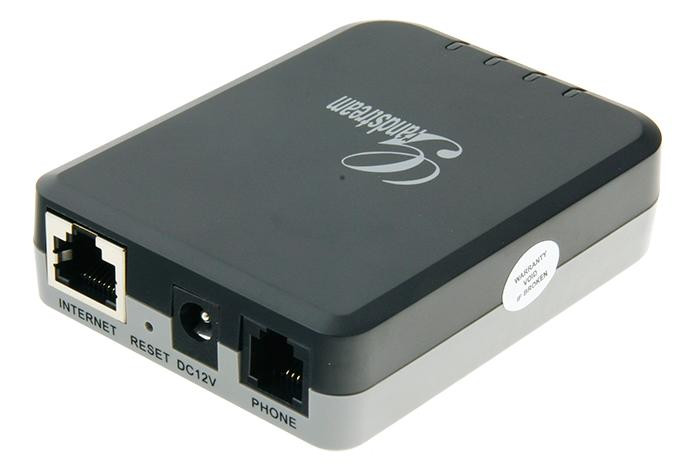
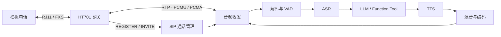

<div align="center">


### Agent Telephone ☎️

[](https://dotnet.microsoft.com/)
[](./LICENSE)

</div>


（中文 | [English](./README_en.md)）

**Agent.Telephone** 是一个使用 `.NET 8` 开发的电话语音 Agent 服务 SDK。

它通过 **SIP 模拟电话网关**，把普通座机通过 SIP/RTP 通话接入 **大模型** 语音通话。

## 文档导航 📚

| 我想要…… | 从这里开始 |
| --- | --- |
| 完成第一通电话 | [快速开始与部署](docs/00-快速开始与部署.md) |
| 配置 HT701 | [HT701 网关配置与兼容性](docs/01-HT701网关配置与兼容性.md) |
| 查找配置字段 | [配置文件参考](docs/02-配置文件参考.md) |
| 理解架构与音频链路 | [系统架构与音频流水线](docs/03-系统架构与音频流水线.md) |
| 编写 Function Tool / DTMF 交互 | [FunctionTool 与按键交互扩展](docs/04-FunctionTool与按键交互扩展.md) |
| 扩展存储、回拨与留言 | [持久化、回拨与离线留言](docs/05-持久化、回拨与离线留言.md) |
| 设计多个 Assistant | [Assistant 角色与业务场景](docs/06-Assistant角色与业务场景.md) |
| 排查部署问题 | [故障排查与运维](docs/07-故障排查与运维.md) |
| 了解生产安全边界 | [安全、隐私与生产运行边界](docs/08-安全、隐私与生产运行边界.md) |
| 了解这个项目的目录结构 | [项目目录、外部资源与内置提示音](docs/09-项目目录、外部资源与内置提示音.md) |

## 快速开始 👋

### 一、材料准备 🧰

- SIP 网关设备

网关设备推荐单网口设备，例如 **潮流网络 HT701**，闲鱼和拼多多就可以淘到。




*后续文档都以 `HT701` 作为网关进行说明*

- 标准 RJ11 接口模拟电话

 普通家用座机电话。


### 二、电话网关配置 📞

参照 [SIP网关说明书](https://www.manuallib.com/download/pdf16/GRANDSTREAM-TECHNOLOGY-HT701-ANALOG-TELEPHONE-ADAPTER-1.0.0.17-USER-MANUAL.PDF)，进入到设备后台进行配置。
> [!TIPS]
> 步骤1：使用模拟电话，拨打“***”进入IVR语音菜单。输入“02”获取HT701当前的IP地址。<br/>
> 步骤2：在网页浏览器的地址栏中输入获取到的IP地址，进入登录页面。<br/>
> 步骤3：输入密码“admin”登录设备，进行配置。

📚 第一次部署如果不清楚的话，建议参考我的 [HT701设备配置](./docs/HT701Settings) 开始。


### 三、程序文件结构


```
.
├── configs
│   ├── AssistantPrompts # 每个Assistant角色的前置提示词文件目录
│   │   ├── 10000.md
│   │   ├── 10086.md
│   │   ├── 10085.md
│   │   └── ...
│   └── config.json # 主配置文件
├── data
│   ├── asr-cache  # 当开启保存用于asr识别的音频文件后，用户说话的音频将会保存在这里
│   ├── messages-db  # 消息持久化SQLite DB
│   └── tts-cache # 当开启保存tts生成的文件后，生成的语音将会保存在这里
├── ffmpeg # 存放 ffmpeg v7.1.1 二进制文件
├── logs # 系统日志文件
├── models  # 所有模型存放的目录
│   ├── asr  # 模型类型
│   │   └── sense-voice  # 模型名称文件夹
│   │       ├── model.onnx  # 模型文件
│   │       └── tokens.txt  # 模型所需tokens文件
│   ├── tts
│   │   └── kokoro
│   │       ├── dict
│   │       ├── espeak-ng-data
│   │       ├── lexicon
│   │       │   └── lexicon-xxxx.txt  # 余下的3个txt文件
│   │       ├── model.onnx  # 模型文件
│   │       ├── tokens.txt  # 模型所需tokens文件
│   │       └── voices.bin  # 模型音色文件
│   └── vad
│       ├── silero
│       │   └── model.onnx  # 模型文件
│       └── silero-native
│           └── model.onnx  # 模型文件
├── ... #其他依赖文件
└── Agent.Telephone.Sample.Server.exe # 示例主程序


```

### 四、启动示例服务 ▶️

#### 1. 修改 `config.json` 配置

根据自身喜好，替换 LLM 的 API Key 和 TTS API Key，示例配置中使用的 `Deepseek` 和 `火山引擎` 的配置。

详情配置请移步 [02-配置文件参考文档](./docs/02-配置文件参考.md)。

#### 2. 下载模型文件和FFmpeg

从 [Agent.Telephone Resource Files](https://github.com/mm7h/Agent.Telephone/releases#release-resources) 下载 FFmpeg 与 ONNX 模型资源。
根据项目目录结构将资源文件放到对应的目录中。

#### 3. 项目构建与运行

在仓库根目录构建项目：

```powershell
dotnet restore Agent.Telephone.sln
dotnet build Agent.Telephone.sln --no-restore
```

进入示例宿主目录运行。程序会以当前目录为基准查找 `configs/`、`models/`、`ffmpeg/` 与运行数据：

```powershell
Set-Location demo/Agent.Telephone.Sample.Server
dotnet run
```

此时Console中会显示当前服务的IP地址，请在 [网关配置](#电话网关配置) 中将 `FXS端口` 的 `主SIP服务端` 的IP地址替换过去。
再次确认如下信息：
> 1. 已根据文档 [HT701 网关配置与兼容性](docs/01-HT701网关配置与兼容性.md) ，将 FXS 账户注册到本服务，并启用 PCMU/PCMA 与 RFC2833 DTMF；
> 2. Console中已提示 HT701 已注册。

从模拟电话拨打 [配置文件](./demo/Agent.Telephone.Sample.Server/configs/config.json) 中存在的号码，例如 `10000`，听到开场白后说一句话，完成第一通 `AI电话`。


## 五、功能清单 ✨


### 已实现 ✅

| 功能名称 | 说明 |
| :---: | --- |
| ☎️ 电话语音对话 | 通过 HT701 接入 SIP/RTP，支持 PCMU、PCMA 音频协商与电话端语音收发。 |
| ⚡ 流式 AI 流水线 | 用户语音依次经过 VAD、ASR、LLM、TTS；支持流式输出与用户抢话打断。 |
| 🎭 多 Assistant | 一个拨号号码绑定一个 Assistant；前台可在**同一 SIP/RTP 通话内**切换到其他角色。<br/>电话接通后会根据打招呼语的模板配置，随机选择一条进行 TTS 播报。 |
| 🧩 Function Tool | 支持全局工具与每通话私有工具，并通过 `AllowedTools` 控制每个 Assistant 的授权范围。 |
| 🔢 DTMF 按键交互 | 支持 RFC2833 按键输入、菜单选择，以及敏感工具执行前的电话按键确认。 |
| 📲 回拨与离线留言 | 用户提前挂断后不影响 LLM 继续生成回复。<br/>在 LLM 完全生成回复后如果用户没有保持通话，则随后会尝试回拨。<br/>用户长时间未接听，则投递失败并保存为未读电话留言，下次拨相同号码接通后，会提示离线留言。 |
| 💾 可扩展持久化 | 通过 `ITelephoneStore` 接口持久化注册、对话、消息分段与投递状态；示例提供 SQLite 实现。 |
| 🔊 多媒体音频 | 使用 FFmpeg 解码、重采样、混音与编码，并提供内置号码、等待音和错误提示音。 |
| 🛠️ 可替换模型组件 | VAD、ASR、LLM、TTS 与 Intent 均按统一 Provider 接口组织，可按配置选择实现。 |
| 💻 Codex 任务助理 | 示例号码 `10088` 可调用独立 Codex CLI 执行非交互任务；该能力为可选示例。|

> 🎯 Assistant 切换不是重新建立电话。系统会保留原有 SIP dialogue、媒体会话与设备身份，只替换当前 Agent 会话。

## 已接入的平台 / 模型 📋

### LLM 语言模型 🧠

LLM 通过 OpenAI 兼容 API 接入，示例配置包含以下平台：

| 平台名称 | 
| :---: |
| 智谱 ChatGLM |
| DeepSeek |
| 火山引擎 Doubao |
| 阿里云 Qwen |

也可以配置其他遵循 OpenAI API 规范的模型服务；不同服务的兼容程度应以实际接口行为验证。

### 语音模型 🎙️

| 能力 | 平台 / 模型 | 备注 |
| :---: | --- | --- |
| VAD | Silero、Silero Native | 分别基于 sherpa-onnx 与 ONNX Runtime。 |
| ASR | SenseVoice、Paraformer | 基于 sherpa-onnx 的本地语音识别。 |
| LLM | 智谱 ChatGLM、DeepSeek、Doubao、Qwen | 需要配置好Api Key |
| TTS | Kokoro、火山引擎 | sherpa-onnx 需要配置本地好本地模型 |
| Intent | None、IntentLlm、FunctionCall | 可关闭意图层、使用独立 LLM，或启用工具调用。 |

## 六、项目原理 🧭

HT701 负责把摘机、拨号、振铃与模拟语音转换为 SIP/RTP；Agent.Telephone 负责通话生命周期、媒体协商、AI 流水线与业务状态。



一次普通对话会依次经过：

`SIP/RTP → AudioReceivedHandler → Audio2TextHandler → DialogueHandler → Text2AudioHandler → AudioSendHandler → RTP`

详细设计见 [系统架构与音频流水线](docs/03-系统架构与音频流水线.md)。


## 注意事项 ⚠️

- **HT701 是当前唯一明确验证的硬件**，但其他 HTx01 或第三方 FXS 网关如支持标准 SIP 注册、RTP、PCMU/PCMA 与 RFC2833，原理基本上都大同小异，可以利用自行查询文档进行配置或者对本项目进行二次适配开发。
- 项目应在可信任的局域网内部署。
- HT701 只是电话网关，不负责 AI 状态、角色切换或回复恢复；所有并发、取消、媒体与持久化逻辑都由服务端管理。
- `10088` Codex Assistant 使用 `codex exec --ephemeral` 执行非交互任务，不提供电话审批、追问或 Codex Thread 恢复，不应直接作为生产主机管理入口。
- 注意个人隐私，不要泄露 Api Key 等敏感数据。
- 修改配置或二次开发前，请先阅读 [安全、隐私与生产运行边界](docs/08-安全、隐私与生产运行边界.md)。
- 本项目的实现方式仅供参考，若要发布到生产环境建议使用 [FreeSwitch](https://github.com/signalwire/freeswitch) / [Asterisk](https://github.com/asterisk/asterisk) 或者其他成熟的商业框架。

## 贡献 🙌

本项目希望为 `.NET` 生态提供一个可运行、可扩展的电话语音 Agent 实现。

一切的灵感来源于抖音 **@硅忆说** 在7月6日发布的短视频。

如果你在部署、硬件兼容或二次开发中遇到问题，欢迎提交 Issues 和 Pull Requests。

提交代码前请至少运行：

```powershell
dotnet restore Agent.Telephone.sln
dotnet build Agent.Telephone.sln --no-restore
dotnet test Agent.Telephone.sln --no-build
```

## 特别鸣谢 ❤️

| 项目 / 组件 | 用途 |
| :---: | --- |
| [SIPSorcery](https://github.com/sipsorcery-org/sipsorcery) | SIP、SDP 与 RTP 能力。 |
| [sherpa-onnx](https://github.com/k2-fsa/sherpa-onnx) | 本地 VAD、ASR 与 TTS 模型运行。 |

## 许可证 📝

[Apache License](./LICENSE)
