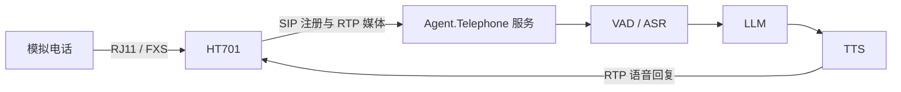

# 🚀 快速开始与部署

本文面向第一次部署或二次开发 `Agent.Telephone` 的开发者，目标是完成一条最小闭环：**HT701 注册到本服务，模拟电话拨打一个 Assistant 号码，并听到语音回复**。配置项的逐字段说明见后续《配置文件参考》；HT701 的页面级设置见《HT701 网关配置与兼容性》。

> 本文以 `demo/Agent.Telephone.Sample.Server` 为可运行宿主。请先在隔离的局域网中验证，不要把未加固的 SIP 服务或 HT701 管理页面直接暴露到公网。

> ✅ **完成标志**：HT701 成功注册，模拟电话拨打一个 Assistant 号码，并听到可用的语音回复。



*图：首次部署成功后，一通电话应形成的最小端到端闭环。*

## 🧩 1. 运行方式与组成

```text
模拟电话 ──(RJ11/FXS)── HT701 ──(SIP/RTP over LAN)── Agent.Telephone 服务
                                                             │
                                                             ├─ VAD / ASR 本地模型
                                                             ├─ LLM 服务
                                                             └─ TTS 服务 / 本地模型（可选）
```

HT701 是一台带一个 FXS 口的模拟电话网关：它把电话摘机、拨号、振铃和语音转换为标准 SIP/RTP；


本项目是 SIP 服务端和 AI 音频流水线。两者必须能在网络中双向通信。

示例宿主从**进程的当前工作目录**读取 `configs/config.json`，本地模型也以该目录下的 `models/` 为根目录。最稳妥的首次启动方式是进入示例项目目录后执行 `dotnet run`，不要从任意目录启动再假定相对路径仍然正确。

## ✅ 2. 前置条件

- Windows、Linux 或 macOS 主机，已安装与项目目标框架匹配的 **.NET 8 SDK**。
- 一台可接入局域网的 HT701、一个 RJ11 模拟电话，以及网关的 12V 电源与网线。
- 主机与 HT701 最好位于同一局域网；首次部署不要先引入跨公网 SIP、NAT、端口映射或 SIP ALG。
- 可用的 LLM/TTS 凭据。当前示例默认 Assistant 选择 `Deepseek` 和 `HuoshanBidirection （火山引擎双向流式 TTS ）`；
- 与宿主系统和 CPU 架构匹配的 FFmpeg 原生库及需要的 ONNX 模型。
- 如需启用 Codex 任务助理：在**运行电话服务的同一系统账户**下安装并登录独立 Codex CLI，并在 Demo 的 `.WithCodexAssistant(options => ...)` 中配置可执行文件、模型和推理强度。完整设置见 [Codex 任务助理配置指南](10-Codex助手.md)。

## 📦 3. 下载并放置资源文件

请从 **XiaoZhi.Net** 的资源发布页 [XiaoZhi.Net Release Resources](https://github.com/mm7h/XiaoZhi.Net/releases#release-resources) 下载与**运行主机的操作系统和 CPU 架构**匹配的资源包。

两个项目采用相同的相对目录约定。解压后应保留资源包的目录层级，不能把 `model.onnx`、FFmpeg DLL/SO 文件或子目录平铺到项目根目录。下面的树以示例宿主目录为工作目录，省略了资源包中当前未启用模型的文件：

```text
demo/Agent.Telephone.Sample.Server/
├─ configs/
│  └─ config.json
├─ ffmpeg/                         # FFmpeg v7.1.1 原生库所在目录
├─ models/
│  ├─ vad/
│  │  ├─ silero-native/model.onnx # 当前启动时加载的本地 VAD
│  │  └─ silero/model.onnx        # 仅 Assistant 选择 Sherpa Silero 时需要
│  ├─ asr/
│  │  ├─ sense-voice/model.onnx   # 仅 Assistant 选择 SenseVoice 时需要
│  │  └─ paraformer/model.onnx    # 仅 Assistant 选择 Paraformer 时需要
│  └─ tts/
│     └─ kokoro/                  # 仅 Assistant 选择 Kokoro 时需要
│        ├─ model.onnx
│        ├─ voices.bin
│        ├─ tokens.txt
│        ├─ espeak-ng-data/
│        └─ dict/
└─ data/                           # 首次运行后按配置可能生成的缓存/数据库目录
```

### 源码实际使用的路径

| 资源 | 源码解析路径 | 何时必需 |
| --- | --- | --- |
| FFmpeg 原生库 | `SIPConfig.FFmpegPath`，示例为 `./ffmpeg/` | 服务构建时即检查，缺失会使启动失败。该目录必须包含当前平台可加载的 FFmpeg 原生库。当前使用的版本是 `7.1.1` |
| Silero Native VAD | `./models/vad/silero-native/model.onnx` | 服务启动时加载；示例默认配置也选择它。 |
| Sherpa Silero VAD | `./models/vad/silero/model.onnx` | 仅在 Assistant 的 `VAD` 选为 `Silero` 时。 |
| SenseVoice ASR | `./models/asr/sense-voice/model.onnx` | 仅在 Assistant 的 `ASR` 选为 `SenseVoice` 时；示例默认使用。 |
| Paraformer ASR | `./models/asr/paraformer/model.onnx` | 仅在 Assistant 的 `ASR` 选为 `Paraformer` 时。 |
| Kokoro TTS | `./models/tts/kokoro/model.onnx`、`voices.bin`、`tokens.txt`、`espeak-ng-data/`、`dict/`，以及 `Lexicons` 指定的词典文件 | 仅在 Assistant 的 `TTS` 选为 `Kokoro` 时。示例默认使用云端火山 TTS，不需要此目录。 |

`model.onnx` 之外的同包文件可能由上游模型运行时或之后启用的模型配置使用。因此建议保留整个对应模型目录，而不是只拷贝上表中当前代码直接拼出的文件。

若希望把资源放在其他位置，可以修改 `configs/config.json` 中的 `SIPConfig.FFmpegPath` 指向 FFmpeg 目录；模型根目录目前由代码按启动工作目录下的 `models/<类型>/<模型名>/` 约定定位。首次部署建议先遵守默认目录，确认通话闭环后再调整运行目录或宿主代码。

## ⚙️ 4. 配置示例 SIP 服务端

编辑 `demo/Agent.Telephone.Sample.Server/configs/config.json`，至少完成下列项目：

1. `SIPConfig.IP`：服务监听的 IPv4 地址。局域网测试可保持 `0.0.0.0`；HT701 的“主 SIP 服务器”仍应填写主机实际 LAN IP，例如 `192.168.1.20`，而不是 `0.0.0.0`。
2. `SIPConfig.Port`：默认 `5060`，应与 HT701 的主 SIP 服务器端口一致。当前服务仅建立 UDP SIP 监听。
3. `SIPConfig.FFmpegPath`：资源目录中 FFmpeg 的根路径。保持 `./ffmpeg/` 时应按上一节位置解压。
4. `ModelConfig.ConfiguredSettings.LLM`：为所选 LLM 填入真实 `BaseUrl`、`ApiKey` 和 `ModelName`。
5. `ModelConfig.ConfiguredSettings.TTS`：为所选云端 TTS 填入真实凭据，或把 Assistant 的 `TTS` 改成已放置好 Kokoro 资源的本地 TTS。
6. `AssistantConfigs`：确认至少有一个 `DialingNumber`，例如示例的 `10000`。这是用户在电话上拨打的目标号码，不是 HT701 的 SIP 用户 ID。

示例配置中的密钥均为占位值。请只在本机或受控的密钥管理机制中填写真实值，绝不提交回仓库。首次在私有测试网络中运行时，示例的 `AuthEnabled` 为 `false`；这意味着服务端不会以 SIP 密码验证 REGISTER/INVITE，请把服务端与网关限制在可信网络中。

## ▶️ 5. 启动服务

在仓库根目录执行：

```powershell
dotnet restore Agent.Telephone.sln
dotnet build Agent.Telephone.sln --no-restore

Set-Location demo/Agent.Telephone.Sample.Server
dotnet run
```

启动成功时，控制台/`logs/` 应能看到 FFmpeg 已加载以及 SIP 服务开始监听 `SIPConfig.IP:SIPConfig.Port` 的日志。若日志提示未找到 FFmpeg 或模型文件，先核对当前目录和上一节的资源树，而不是只检查仓库根目录。

Windows 防火墙或主机安全软件必须允许服务接收 SIP UDP 数据报。通话媒体 RTP 端口由会话协商，不应只依据 HT701 的“本地 RTP 端口”开放单个固定端口；在同一可信 LAN 完成验证后，再按照部署网络的防火墙与 NAT 策略明确允许范围。

## ☎️ 6. 配置网关并完成首次通话

1. 按《[HT701 网关配置与兼容性](01-HT701网关配置与兼容性.md)》把 HT701 的 FXS 账户注册到本服务。
2. 在 HT701 Web 页面确认账户状态为已注册，再从模拟电话摘机。
3. 拨打 `config.json` 中存在的 `AssistantConfigs[].DialingNumber`，如 `10000`。当前示例中默认以配置的第一个 `DialingNumber` 作为“客服接待员”角色。若启用了“使用 # 作为拨号键”，最后按 `#` 立即发起呼叫，具体需要在 HT701 网关中配置。
4. 接通后应依次听到号码/服务提示与该 Assistant 的开场白；说一句短句，等待 ASR、LLM 和 TTS 返回语音。

首次通话的检查顺序如下：

| 观察点 | 成功表现 | 失败时优先检查 |
| --- | --- | --- |
| 服务进程 | 输出 SIP 监听日志，无 FFmpeg/模型加载错误 | 工作目录、`ffmpeg/`、`models/vad/silero-native/model.onnx`、端口占用。 |
| HT701 注册 | 页面显示已注册或服务端日志记录设备注册 | 主机 IP/端口、UDP、防火墙、同网段连通性。 |
| 拨号 | 服务端记录 INVITE，电话接通 | 所拨号码是否是已配置 Assistant、HT701 拨号规则与 `#` 设置。 |
| 听到开场白 | 能听到提示和 Assistant 语音 | SDP 是否包含 PCMU 或 PCMA、RTP 可达性。 |
| 问答回复 | 语音识别和合成均完成 | LLM/TTS 凭据、网络访问、模型选择及日志中的模型服务错误。 |

## 🛡️ 7. 部署边界

- 当前 SIP 服务只接受 **PCMU（G.711 μ-law）与 PCMA（G.711 A-law）** 音频协商；配置 HT701 时至少保留这两个编解码器并置于靠前位置。
- DTMF 功能依赖 RFC2833 电话事件。需要按键菜单、确认或 Function Tool 按键交互时，按网关文档把 DTMF 优先方式设为 RFC2833，并保留协商。
- 从服务端到 HT701 的回拨、留言播放依赖网关的有效 SIP 注册 Contact；不要将网关配置成“只呼出、不注册”。
- 本文不承诺公网 SIP、TLS、SRTP、STUN、SIP ALG 或不同厂商设备的互操作性。它们应在局域网方案验证完成后，按实际网络与安全要求单独测试。

后续阅读建议：先阅读《配置文件参考》了解模型与 Assistant 选择，再阅读《系统架构与音频流水线》理解通话生命周期；需要修改网关时使用下一篇 HT701 指南。

下一篇：[01-HT701网关配置与兼容性.md](01-HT701网关配置与兼容性.md)
