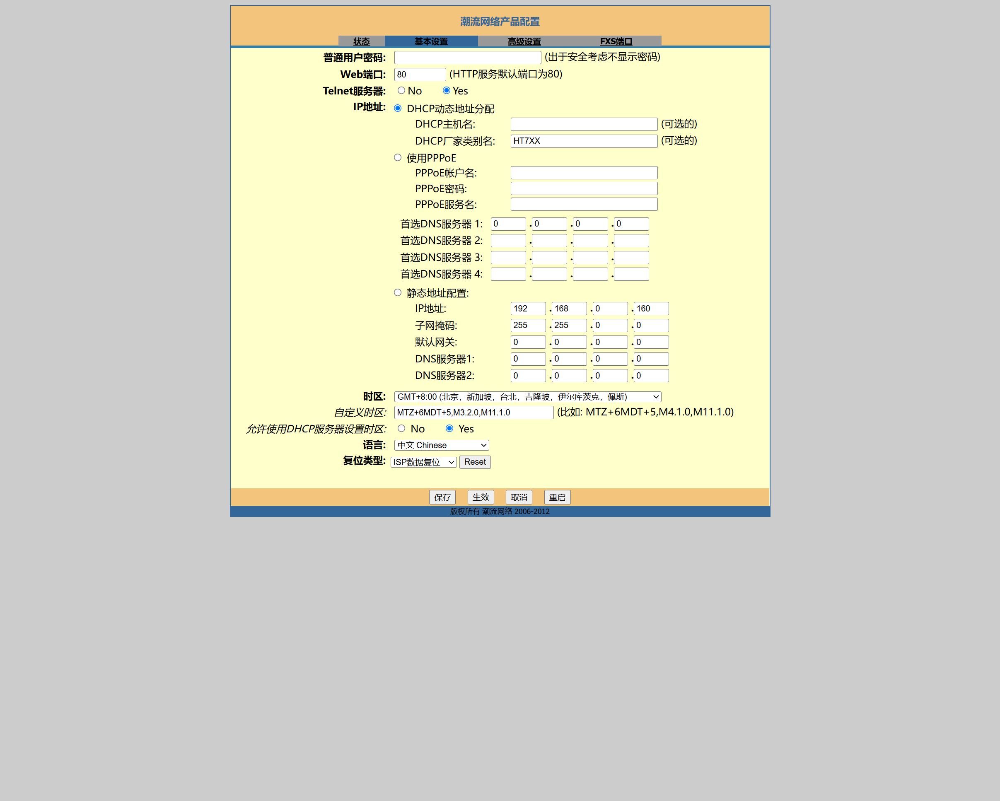
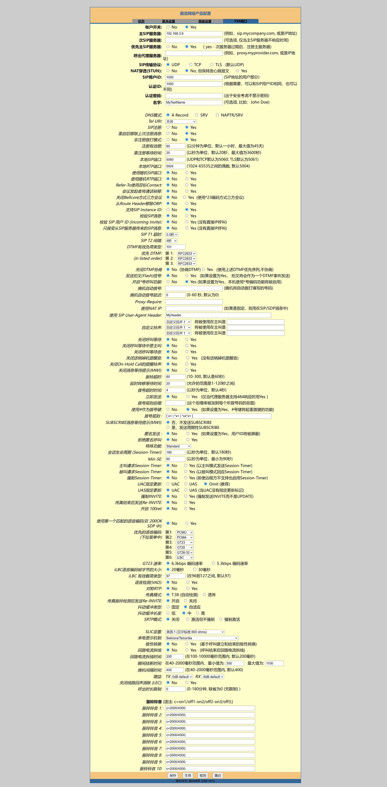
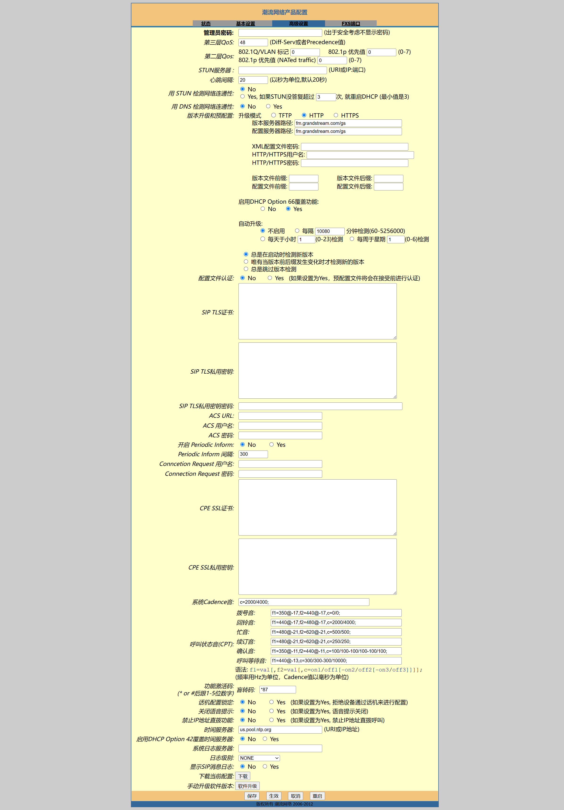

# ☎️ HT701 网关配置与兼容性

HT701 是本项目把传统模拟座机接入 SIP/RTP 的边缘设备。电话接在 HT701 的 **FXS** 口，HT701 通过以太网注册到 `Agent.Telephone`；用户在电话上拨打 Assistant 号码后，HT701 发起 SIP INVITE，项目再完成音频处理与 RTP 回传。

```text
电话机 ── RJ11 ── [HT701 的 FXS 口] ── HT701 ── UDP SIP / RTP ── Agent.Telephone
   拨号、按键、语音             SIP 注册、INVITE、DTMF                  Assistant
```

本仓库当前的互操作验证基准是 **HT701**。其他 HTx01 或其他厂商网关只能按本文末尾的能力清单自行验证，不能视为项目已验证或发布级支持的硬件。

## 🔢 1. 部署前先区分三个号码

初次部署最容易混淆下面两种号码：

| 名称 | 例子 | 用途 |
| --- | --- | --- |
| HT701 的 SIP 用户 ID | `1000` | 标识和注册这台网关/电话设备；由 HT701 的 FXS 账户配置。 |
| Assistant 拨号号码 | `10000`、`10086` | 用户摘机后实际拨打的业务号码，对应 `config.json` 的 `AssistantConfigs[].DialingNumber`。 |

因此，`1000` 不是必须配置成 Assistant；它可以只是设备身份。服务端只会接受已注册设备发起的呼叫，随后用 INVITE 中的被叫号码选择 Assistant。一个已注册的 HT701 同一时刻只应承载一通活动通话。

开始前确定以下值：

- **服务端 LAN IP**：例如 `192.168.1.20`。HT701 要访问的是这个真实 IP，不能填服务端配置里的监听通配地址 `0.0.0.0`。
- **SIP 端口**：默认 `5060`；当前代码只建立 UDP SIP 监听。
- **设备 SIP 用户 ID**：为该网关分配一个在部署范围内唯一的值，例如 `1000`。
- **可拨打的 Assistant 号码**：以当前 `configs/config.json` 中实际存在的 `DialingNumber` 为准。

首次联调建议让服务端与 HT701 位于同一可信 LAN，先不要穿过公网、复杂 NAT、SIP ALG 或反向代理。

## 🌐 2. 网页管理与基础网络设置

接通电源、网线和电话机后，在同一网络中找到 HT701 的管理地址并登录 Web 页面。设备的发现方式、默认凭据和复位方式会随固件或采购来源不同而变化；请以设备标签和 Grandstream 当前官方资料为准，首次登录后立即修改管理密码。

下面的仓库截图与字段说明保留了当前测试设备的页面，页面文案可能随固件略有不同：

- [基础设置字段表](./HT701Settings/1_basic_settings.md)
- [基础设置截图](./HT701Settings/1_basic_settings.png)



推荐做法：

| 页面/字段 | 建议 | 原因 |
| --- | --- | --- |
| IP 地址获取方式 | DHCP + 路由器地址保留，或正确的静态 IPv4 | 服务端地址稳定、方便定位网关；静态 IP 必须同时填写掩码、网关和 DNS。 |
| 管理员/普通用户密码 | 改为唯一的强密码 | 防止局域网内未授权修改或读取设备设置。 |
| Telnet 服务器 | 关闭 | 现有截图中为开启；生产或日常部署不需要时应关闭。 |
| Web 管理端口 | 保持内网可访问，或改用受控端口 | 不要把管理页面映射到公网。 |
| 时区 / NTP | 设置为部署地点和可信时间源 | 便于核对设备与服务端日志时间。 |
| DNS | DHCP 下通常无需手填；静态地址或使用域名 SIP 服务器时填可用 DNS | 只用 IP 地址且在同一 LAN 时 DNS 不是 SIP 成功的前提。 |

基础页中记录的 `192.168.0.160`、DHCP 厂家类别和其他示例值仅是当时设备页面值，**不可照抄为你的网络配置**。

## 🔐 3. FXS 账户：让 HT701 注册到服务端

以下是 HT701 FXS 账户最关键的配置。字段的完整快照见 [FXS 字段表](./HT701Settings/3_FXS.md) 和 [FXS 设置截图](./HT701Settings/3_FXS.png)。



| HT701 字段 | 推荐值 | 与项目的关系 |
| --- | --- | --- |
| 帐户开关 | `Yes` | 必须启用该 FXS 端口的 SIP 账户。 |
| 主 SIP 服务器 | 服务端真实 LAN IP 或可解析主机名，例如 `192.168.1.20` | 对应服务端的 `SIPConfig.IP` 所在主机；若端口不是 5060，在页面可用的端口字段中一并配置。 |
| 次 SIP 服务器 / 呼出代理服务器 | 首次部署留空 | 本项目不是双 SIP Proxy 部署，先排除故障切换和代理带来的变量。 |
| SIP 传输协议 | `UDP` | 当前服务端创建 UDP SIP 监听，不应配置为只使用 TCP 或 TLS。 |
| SIP 用户 ID | 本网关唯一的设备 ID，例如 `1000` | 服务端据此识别已注册设备；不是 Assistant 业务号码。 |
| 认证 ID / 认证密码 | 按你的设备认证策略填写 | 示例 `AuthEnabled=false` 时服务端不会用 SIP 密码校验 REGISTER/INVITE；不要把“填了密码”误认为已获得服务端保护。启用认证时需要在宿主中注册 `IBasicVerify` 并用实际策略联调。 |
| SIP 注册 | `Yes` | 必须注册；项目回拨、留言播放等能力也依赖有效的注册 Contact。 |
| 注册有效期 / 重注册等待时间 | 可沿用截图的 60 分钟 / 20 秒作为起点 | 重点是设备能持续注册，断网或重启后能重新注册。 |
| 本地 SIP / RTP 端口 | 可保留设备默认固定端口 | 固定端口有利于防火墙排查；不能只开放一个 RTP 端口就假定所有媒体都可达。 |
| 使用随机 SIP/RTP 端口 | 首次联调选 `No` | 便于抓包和防火墙排查；不是服务端协议硬约束。 |
| 非注册拨打模式 | 建议 `No` | 项目要求设备先注册才接受 INVITE，开启它不能绕过注册。 |
| 使用 # 作为拨号键 | `Yes`（建议） | 拨完 Assistant 号码后按 `#` 可立即发起 INVITE，避免等待拨号超时。 |
| 拨号规则 | 覆盖所需 Assistant 数字号码及所需的 `*`/`#` | 例如要拨 `10000` 和 `10086`，规则不能阻止这些号码；更改规则后逐个拨号验证。 |

服务端启动后应记录“已启动 SIP 服务，监听地址：IP:Port”。保存并应用 HT701 配置后，服务端应记录设备已注册及其 Contact。若在网页上或日志中看不到注册成功，先不要进行拨号测试。

## 🎧 4. SIP、媒体与 DTMF 设置

本项目的媒体协商约束比网关的可选项更少：服务端只接受 SDP 中包含 **PCMU（G.711 μ-law）或 PCMA（G.711 A-law）** 的音频媒体。若没有这两个编解码器，服务端会拒绝呼叫并返回 `488 Not Acceptable Here`。

完整的高级 SIP/媒体字段与当前测试截图见：

- [高级 SIP 与媒体字段表](./HT701Settings/2_advanced_sip_media_features.md)
- [高级 SIP 与媒体截图](./HT701Settings/2_advanced_sip_media_features.png)



| HT701 字段 | 推荐值 | 说明 |
| --- | --- | --- |
| 优先的语音编码 | 将 `PCMU`、`PCMA` 置于最前；首次联调可仅保留这两项 | 与服务端的唯一支持编解码器集合一致，避免设备优先使用 G.723、G.729、G.726 或 iLBC。 |
| 语音检测（网关静音抑制） | `No` | 不让网关丢弃静音帧，避免影响 VAD 和实时对话的音频连续性。 |
| DTMF 有效负荷类型 | `101` 可作为常见起点 | RFC2833 的 `telephone-event` 载荷值由 SDP 协商；重要的是双方协商成功，而不是机械固定某个值。 |
| 优先 DTMF | RFC2833 优先 | 按键确认、离线留言菜单等功能通过电话事件接收按键；不要仅依赖 In-band 或 SIP INFO。 |
| 关闭 DTMF 协商 | `No` | 保留 SDP 协商，避免与服务端不同载荷值时按键失效。 |
| SRTP 模式 | `关闭`，不要强制 | 当前服务端按 UDP SIP 和普通 RTP 方式工作；强制 SRTP 属于未在本部署路径验证的扩展。 |
| SIP TLS | 不配置为必需 | 当前服务端没有 TLS SIP 监听；不要只在网关侧启用 TLS。 |
| ptime（若固件提供） | 优先 20 ms | 服务端会读取 SDP 的 `ptime`，未给出时以 20 ms 为回退。不要设成极端的大帧长。 |
| 抖动缓冲 | 自适应 / 中，作为起点 | 当前截图使用这一组合；网络稳定后按实际抖动测试调整。 |
| 关闭线路回声消除（LEC） | `No`，即保持回声消除启用 | 模拟话机和环境容易产生回声；只有定位到回声处理冲突时才调整。 |
| TX/RX 增益 | 从默认值开始 | 出现削波、过低音量或回声时再小步调整，并每次重新测试 ASR 与播放。 |

SIP/RTP 穿越 NAT、STUN、对称 RTP、SIP ALG、外网端口映射和 SRTP 不是本项目的默认部署路径。若确有跨网段或公网需求，先在同 LAN 验证成功，再由网络管理员为 SIP 与协商出的 RTP 流量设计双向可达、受限的规则；不要把网关管理页或裸 SIP 端口直接公开到互联网。

## ✅ 5. 逐步验证

按下面顺序检查能缩小问题范围：

1. **服务已启动**：在运行示例宿主的控制台确认 SIP 监听日志；FFmpeg 和本地 VAD 模型也必须先加载成功。
2. **网络可达**：HT701 与服务端使用可路由的 LAN IPv4 地址；主机防火墙允许进入 `SIPConfig.Port` 的 UDP 流量。
3. **注册成功**：HT701 账户显示 Registered，服务端记录 REGISTER 与设备 Contact。
4. **拨号成功**：摘机，拨 `config.json` 中已配置的 Assistant 号码，必要时按 `#`；服务端记录 INVITE。
5. **媒体协商成功**：电话接通并听到开场白。若接通但无声，先确认 SDP 同时提供 PCMU/PCMA，再排查 RTP 的双向可达性。
6. **DTMF 成功**：若配置了按键确认或留言菜单，按允许的数字键，观察服务端是否接收相应电话事件。

| 现象 | 常见原因 | 优先处理 |
| --- | --- | --- |
| HT701 一直未注册 | 主 SIP 服务器 IP/端口错误、UDP 被拦截、设备与服务器不通 | 从网关 ping/网络状态、主机防火墙和服务监听日志开始。 |
| 注册后拨号收到 404 | 所拨号码不在 `AssistantConfigs` | 使用 `DialingNumber` 中确实存在的号码，检查拨号规则是否改写了号码。 |
| 拨号收到 488 | SDP 未携带 PCMU 或 PCMA | 调整优先编码，首次联调禁用其他优先编解码器。 |
| 已接通但单向/双向无声 | RTP 路径、防火墙、NAT/SIP ALG 或编解码协商问题 | 在同一 LAN 复现，抓取 INVITE/200 OK 的 SDP 和 RTP 流向。 |
| 按键无反应 | 未使用 RFC2833、DTMF 协商被关闭，或当前业务未等待按键 | 设 RFC2833 优先、打开协商，并用实际支持按键的业务场景测试。 |

## 🛒 6. 采购与二手设备检查

HT701 可以在闲鱼等二手平台采购，但二手设备状态和固件来源不可假定。建议在成交前或收到后逐项确认：

- 型号确为 **HT701**，且需要的是 FXS 模拟电话口，不是仅用于接入外部模拟线路的 FXO 产品。
- 电源适配器规格、插头和地区电压匹配；RJ11 口与普通模拟电话兼容。
- 网口、FXS 口、摘挂机、振铃、DTMF 按键和双向音频均可实际测试。
- 设备可以恢复出厂设置且没有运营商锁定、未知远程预配置、残留账号或不明管理员密码。
- 固件来源可信；升级或复位前导出当前配置，避免在生产设备上直接刷未知固件。
- 收到后立即更改 Web 管理密码，关闭不需要的 Telnet、远程预配置、TR-069 和外网管理入口。

采购渠道只解决硬件取得，不代表该设备、卖家固件或配件已被本项目验证。

## 🧪 7. 其他 HTx01 是否可用

结论是：**只能确认 HT701 为当前已验证基准；不能直接承诺任一其他 HTx01 型号可用。** 是否兼容取决于能力而不是外壳或型号前缀。

候选网关至少应满足下面所有条件：

| 必需能力 | 本项目为什么需要它 | 验证方式 |
| --- | --- | --- |
| FXS 口可接模拟电话 | 用户侧电话必须能摘机、拨号、振铃和收发语音 | 接入同一部电话，验证来去电与挂机。 |
| 可向任意主机的 UDP SIP 注册 | 服务端按 REGISTER 建立设备上下文并保存 Contact | 指向服务端 LAN IP/端口，检查 REGISTER 及续租日志。 |
| 呼出 INVITE 能保留被叫 Assistant 号码 | 服务端据 SIP URI 中的被叫号码路由 Assistant | 拨打 `10000` 等配置号码，检查服务端 INVITE 日志。 |
| SDP 提供 PCMU 或 PCMA | 这是服务端仅支持的电话音频集合 | 抓取 SDP；至少一个受支持编码必须被协商。 |
| RTP 双向收发 | 用户语音和 TTS 都依赖 RTP | 验证通话中听到开场白且 ASR 能识别用户语音。 |
| RFC2833 DTMF（telephone-event） | 按键确认、留言菜单等交互需要 | 启动一个等待按键的场景，验证数字键和 `*`/`#`。 |
| 支持普通 RTP、可不强制 TLS/SRTP | 默认服务端路径是 UDP SIP + RTP | 禁用强制 TLS/SRTP 后完成一次通话。 |

对于每一种候选设备，请独立记录固件版本、上述验证结果、网关配置导出、SIP/SDP 报文和已知限制；通过完整的注册、首呼、语音问答、DTMF、挂断以及（如启用）回拨/留言播放测试后，再把它列为项目支持设备。

## 🔗 8. 相关资料

- [快速开始与部署](00-快速开始与部署.md)
- [基础设置字段表](./HT701Settings/1_basic_settings.md)
- [高级 SIP 与媒体字段表](./HT701Settings/2_advanced_sip_media_features.md)
- [FXS 字段表](./HT701Settings/3_FXS.md)

上一篇：[00-快速开始与部署.md](00-快速开始与部署.md)<br />
下一篇：[02-配置文件参考.md](02-配置文件参考.md)
