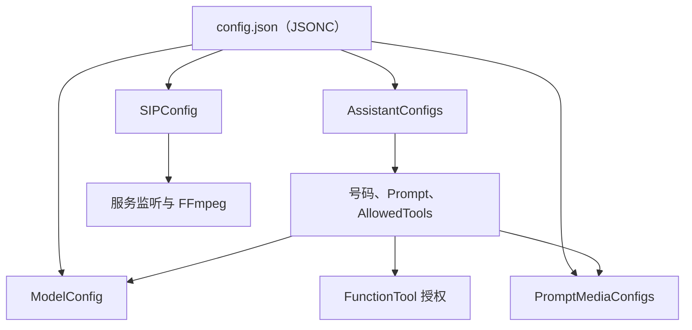

# ⚙️ 配置文件参考

示例宿主读取 `demo/Agent.Telephone.Sample.Server/configs/config.json`。它使用 `System.Text.Json` 的大小写不敏感模式，并允许 `//` 注释，因此示例文件实际上是 **JSONC 风格**。启动前会把每个 Assistant 的 `Prompt` 当作相对 `configs/` 目录的文件路径读取，再把文件正文替换到运行时配置中。

> 示例里所有 Token、Key 与电话号码只是占位值。生产环境应从受保护的配置源注入，不能提交到 `config.json`。

> 💡 **配置原则**：Assistant 只引用已存在的模型和工具名称；`AllowedTools` 是实际授权边界，不是说明文字。



*图：配置不是孤立字段；Assistant 会引用模型、工具和提示音配置。*

## 🧱 顶层配置

| 字段 | 含义与建议 |
| --- | --- |
| `AuthEnabled` | 是否启用 SIP 基础校验。启用后宿主必须注册 `IBasicVerify`；仅改为 `true` 而没有验证实现会拒绝设备请求。 |
| `LogSetting` | 控制日志等级、文件路径、Serilog 输出模板和保留文件数。生产环境建议 `INFO`，排障时临时改为 `DEBUG`。 |
| `SIPConfig` | 服务端监听地址、端口、FFmpeg 根目录和通话超时。见下表。 |
| `AssistantConfigs` | 可拨打的 Assistant 列表；每个号码是一种角色和一套模型/工具授权。 |
| `ModelConfig` | Provider 的命名配置表。Assistant 通过名称从表中选择实现与参数。 |

### `LogSetting`

| 字段 | 作用 |
| --- | --- |
| `LogLevel` | 日志最低级别，例如 `DEBUG`、`INFO`、`WARNING`。 |
| `LogFilePath` | 日志文件相对或绝对路径；相对路径以宿主工作目录解析。 |
| `OutputTemplate` | 日志行格式。保留时间、等级、消息和异常通常足够排障。 |
| `RetainedFileCountLimit` | 保留的滚动日志文件数；结合磁盘容量设置。 |

### `SIPConfig`

| 字段 | 作用 |
| --- | --- |
| `IP` | SIP 服务监听地址。`0.0.0.0` 表示监听所有网卡；跨网段部署仍需正确配置防火墙与网关服务器地址。 |
| `Port` | SIP UDP/TCP 监听端口，示例为 `5060`。避免与已有 PBX 或 SIP 服务冲突。 |
| `FFmpegPath` | FFmpeg 根目录，默认 `./ffmpeg/`。该目录必须包含当前平台可执行的 FFmpeg；资源下载与目录验证见快速开始文档。 |
| `HangUpTimeoutSeconds` | 挂断相关的超时配置，默认值为 30 秒。 |
| `AgentInitializationTimeoutSeconds` | FunctionTool、Provider、Handler 在呼叫接通前的初始化上限。初始化较慢的本地模型应适当增大，但不应掩盖模型文件缺失。 |
| `CallbackTimeoutSeconds` | 留言或任务回拨时等待用户接听的上限。 |

### Codex CLI 运行环境

`10088` 不增加 `TelephoneConfig` 或 `config.json` 字段。`CodexAssistant` 直接启动 `codex exec --ephemeral <task>`：CLI 的最终消息写入 stdout，进度与诊断写入 stderr。它优先使用 `CODEX_CLI_PATH` 环境变量指定的可执行文件，未设置时使用 `PATH` 中的 `codex`。

服务账户必须预先完成 CLI 登录；不要把 Codex 认证文件、API Key 或 `CODEX_CLI_PATH` 的敏感部署值写入示例配置。根据 [官方 OpenAI 文档](https://learn.chatgpt.com/docs/non-interactive-mode.md)，`codex exec` 默认使用只读沙箱，并要求工作目录位于 Git 仓库；当前示例没有开启写入沙箱、`--skip-git-repo-check`、app-server 或电话审批。

## 🎭 `AssistantConfigs`：一个号码对应一个角色

每个 Assistant 必须拥有唯一的 `DialingNumber`。网关拨打该号码后，服务端在同一已注册设备上选择对应角色。

| 字段 | 作用 |
| --- | --- |
| `DialingNumber` | Assistant 的可拨打号码，同时也是持久化和角色切换的身份维度。首呼固定播报要求该值为纯数字。 |
| `Name` | 角色的可读名称，用于配置维护与日志理解。 |
| `Prompt` | 示例中为 `configs/` 下的 Markdown 相对路径；启动后替换为实际系统提示词内容。 |
| `HelloMessageTempletes` | 接通后随机选取一条作为首呼 TTS 文本。拼写以当前公共模型为准；为空、号码非数字或播放失败时跳过首呼流程。 |
| `VAD` / `ASR` / `Intent` / `LLM` / `TTS` | 分别从 `ModelConfig.ConfiguredSettings` 的同名分类中选择实现。名称必须精确匹配键名。 |
| `TTSSettings` | 多个覆盖字典。当前实现随机选一个字典，将其中同名键覆盖所选 TTS 的基础设置，典型用途是随机 `Speaker`。 |
| `AllowedTools` | 该角色允许暴露给 LLM 的工具方法名或工具限定名；未列出的工具不能被该角色调用。 |

### Intent 与工具的关系

`Intent` 中的 `Type` 决定工具调用路径：

- `None`：不做意图/工具处理。
- `IntentLlm`：用指定的 LLM 进行意图识别并生成工具后的回复。
- `FunctionCall`：将可用 FunctionTool 直接注册给对话 Agent。需要 LLM 调用工具、DTMF 确认或按键交互时应使用该类型。

`AllowedTools` 不是注释，而是授权边界。`FunctionToolManager` 会验证名称是否存在；拼写错误、对不支持 FunctionCall 的角色配置 DTMF 工具，都会导致构建失败或工具不可用。新增工具后必须同时更新 DI 注册、此列表和测试。

## 🧠 `ModelConfig`：实现名称与参数表

`ConfiguredSettings` 的第一层是能力类别，第二层是实现名，最内层为字符串键值配置。示例解析器会把 JSON 数字、布尔值和对象转换为字符串或原始 JSON，再由各 Provider 读取，所以配置中的 `0`、`true`、对象可按示例书写。

`SelectedDefaultSettings` 用于在服务启动时加载共享资源/本地 Sherpa 模型。当前本地模型路径固定为：

```text
models/{providerType}/{kebab-case-model-name}/
```

例如 `SileroNative` 是 `models/vad/silero-native/model.onnx`，`SenseVoice` 是 `models/asr/sense-voice/`。如果角色使用 Sherpa 本地模型，应让默认选择与实际使用的本地模型保持一致；这些 Provider 在启动阶段加载，并不会为每通电话重新加载。

### VAD

| 实现 | 关键设置 |
| --- | --- |
| `SileroNative` | `Threshold`、`ThresholdLow`、`SilenceThresholdSecond`、`CloseConnectionNoVoiceTime`。使用本地 ONNX Silero v4，处理 16 kHz、512 样本帧。 |
| `Silero` | `Threshold`、`SilenceThresholdSecond`、`MinSpeechDurationSecond`、`MaxSpeechDurationSecond`、`CloseConnectionNoVoiceTime`。使用 Sherpa ONNX 模型。 |

阈值过低会把噪声识别为讲话，过高会截断轻声用户；应在实际电话链路上调整，而不是使用电脑麦克风结论。

### ASR

| 实现 | 关键设置 |
| --- | --- |
| `SenseVoice` | `UseInverseTextNormalization`、`DecodingMethod`、`MaxBatchSize`、`BatchWaitTimeMs` 与 `FileSavingOption`。批量大小或等待时间任一条件满足会触发识别。 |
| `Paraformer` | 使用 `FileSavingOption` 控制调试音频保存。 |

`FileSavingOption` 包含 `SaveFile`、`SavePath`、`Format`。保存的语音可能是个人数据，生产环境默认应关闭，或设置加密、访问控制和保留期。

### LLM

LLM 配置使用兼容 OpenAI 风格的 `BaseUrl`、`ApiKey`、`ModelName`。示例提供 ChatGLM、DeepSeek、豆包和 Qwen 命名项；名称只是本项目的配置键，是否可用取决于 URL、模型名和账户权限。

### TTS

| 实现 | 必需/常用设置 |
| --- | --- |
| `Kokoro` | 本地模型资源与 `Lexicons`；可设置 `SpeechRate`、`SpeakerId`、`FileSavingOption`。 |
| `HuoshanBidirection` | `AppId`、`AccessToken`、`ResourceId`、`SpeechRate`、`LoudnessRate`、可选 `Speaker` 与保存配置。 |
| `HuoshanHttp` | `AppId`、`AccessToken`、`Cluster`、`Speaker`、`SpeedRatio`、`VolumeRatio`、`PitchRatio`。 |
| `HuoshanHttpV3` | `AppId`、`AccessToken`、`ResourceId`、`Speaker`、`SpeechRate`、`LoudnessRate`。 |

Assistant 的 `TTSSettings` 只覆盖当前选择 TTS 的同名键，不能替代必需凭据。保存 TTS 音频同样会产生隐私数据。

## ✅ 最小修改流程

1. 复制并保留示例的目录结构，先填好 `SIPConfig.FFmpegPath`、LLM/TTS 凭据和至少一个 Assistant。
2. 为角色创建提示词文件，并把 `Prompt` 指向它。
3. 确保每个 `VAD`、`ASR`、`Intent`、`LLM`、`TTS` 名称在 `ConfiguredSettings` 中有完全一致的条目。
4. 只把该角色需要的工具放入 `AllowedTools`；若要使用工具或按键确认，把 `Intent` 设为 `FunctionCall`。
5. 先启动服务检查模型与 Provider 构建日志，再从 HT701 拨号验证号码、首呼、识别和回复。

## 🩺 常见配置错误

| 现象 | 优先检查 |
| --- | --- |
| 服务启动即报模型不存在 | `models/` 解压层级、模型名的 kebab-case 目录、`SelectedDefaultSettings`。 |
| 接通后初始化超时 | 本地模型是否首次加载过慢、API Key/网络、`AgentInitializationTimeoutSeconds`；不要仅靠增大超时掩盖错误。 |
| 工具不出现或无法调用 | DI 注册、`AllowedTools` 方法名、`Intent.Type` 与工具类型。 |
| 没有首呼问候 | 号码是否为纯数字、`HelloMessageTempletes` 是否非空、提示音缓存和 TTS 是否成功。 |
| 无法播放/保存音频 | `FFmpegPath`、文件目录权限、TTS/ASR 的 `FileSavingOption`。 |
| `10088` 无法执行任务 | 服务账户的 Codex CLI 安装和登录、`CODEX_CLI_PATH`/`PATH`、当前工作目录是否为受控 Git 仓库。 |
