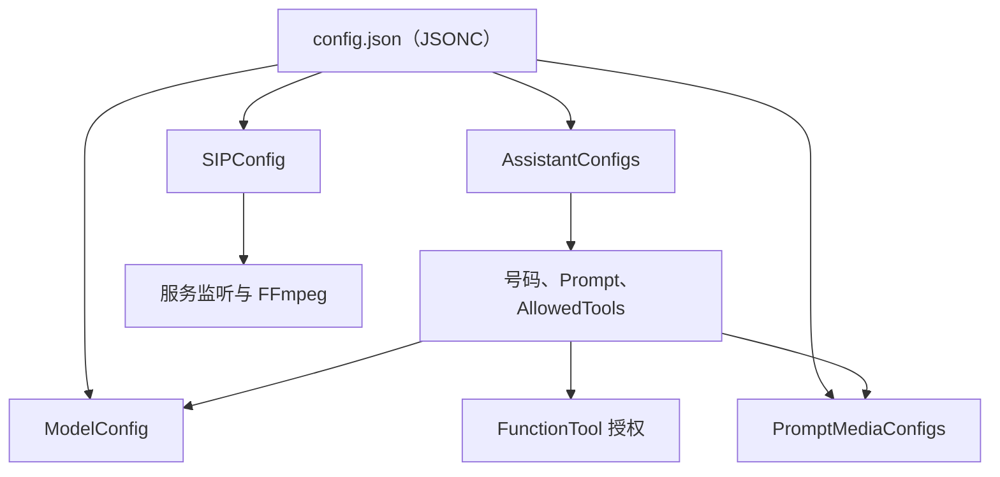

# ⚙️ 配置文件参考

示例宿主读取 `demo/Agent.Telephone.Sample.Server/configs/config.json`。它使用 `System.Text.Json` 的大小写不敏感模式，并允许 `//` 注释，因此示例文件实际上是 **JSONC 风格**。启动前会把每个 Assistant 的 `Prompt` 当作相对 `configs/` 目录的文件路径读取，再把文件正文替换到运行时配置中。

> 示例里所有 Token、Key 与电话号码只是占位值。生产环境应从受保护的配置源注入，不能提交到 `config.json`。

> 💡 **配置原则**：Assistant 只引用已存在的模型和工具名称；`AllowedTools` 是实际授权边界，不是说明文字。



*图：配置不是孤立字段；Assistant 会引用模型、工具和提示音配置。*

## 🧱 顶层配置

| 字段 | 含义与建议 |
| --- | --- |
| `AuthEnabled` | 是否启用 SIP 基础校验。启用后宿主必须注册 `IBasicVerify`；仅改为 `true` 而没有验证实现会拒绝设备请求。 |
| `LogSetting` | 控制日志等级、文件路径、Serilog 输出模板和保留文件数。生产环境建议 `INFO`，排障时临时改为 `DEBUG`。 |
| `SIPConfig` | 服务端监听地址、端口、FFmpeg 根目录和通话超时。见下表。 |
| `AssistantConfigs` | 可拨打的 Assistant 列表；每个号码是一种角色和一套模型/工具授权。 |
| `ModelConfig` | 模型与语音能力的命名配置表。Assistant 通过名称从表中选择实现与参数。 |

### `LogSetting`

| 字段 | 作用 |
| --- | --- |
| `LogLevel` | 日志最低级别，例如 `DEBUG`、`INFO`、`WARNING`。 |
| `LogFilePath` | 日志文件相对或绝对路径；相对路径以宿主工作目录解析。 |
| `OutputTemplate` | 日志行格式。保留时间、等级、消息和异常通常足够排障。 |
| `RetainedFileCountLimit` | 保留的滚动日志文件数；结合磁盘容量设置。 |

### `SIPConfig`

| 字段 | 作用 |
| --- | --- |
| `IP` | SIP 服务监听地址。`0.0.0.0` 表示监听所有网卡；跨网段部署仍需正确配置防火墙与网关服务器地址。 |
| `Port` | SIP UDP/TCP 监听端口，示例为 `5060`。避免与已有 PBX 或 SIP 服务冲突。 |
| `FFmpegPath` | FFmpeg 根目录，默认 `./ffmpeg/`。该目录必须包含当前平台可执行的 FFmpeg；资源下载与目录验证见快速开始文档。 |
| `HangUpTimeoutSeconds` | 挂断相关的超时配置，默认值为 30 秒。 |
| `AgentInitializationTimeoutSeconds` | Assistant 所需模型、工具与通话能力在呼叫接通前的初始化上限。初始化较慢的本地模型应适当增大，但不应掩盖模型文件缺失。 |
| `CallbackTimeoutSeconds` | 留言或任务回拨时等待用户接听的上限。 |

### Codex CLI 运行环境

`CodexAssistant` 直接启动 `codex exec --ephemeral <task>`：CLI 的最终消息写入 stdout，进度与诊断写入 stderr。它优先使用 `CODEX_CLI_PATH` 环境变量指定的可执行文件，未设置时使用 `PATH` 中的 `codex`。

服务账户必须预先完成 CLI 登录；不要把 Codex 认证文件、API Key 或 `CODEX_CLI_PATH` 的敏感部署值写入示例配置。根据 [官方 OpenAI 文档](https://learn.chatgpt.com/docs/non-interactive-mode.md)，`codex exec` 默认使用只读沙箱，并要求工作目录位于 Git 仓库；当前示例没有开启写入沙箱、`--skip-git-repo-check`、app-server 或电话审批。

## 🎭 `AssistantConfigs`：一个号码对应一个角色

每个 Assistant 必须拥有唯一的 `DialingNumber`。网关拨打该号码后，服务端在同一已注册设备上选择对应角色。

| 字段 | 作用 |
| --- | --- |
| `DialingNumber` | Assistant 的可拨打号码，同时也是持久化和角色切换的身份维度。首呼固定播报要求该值为纯数字。 |
| `Name` | 角色的可读名称，用于配置维护与日志理解。 |
| `Prompt` | 示例中为 `configs/` 下的 Markdown 相对路径；启动后替换为实际系统提示词内容。 |
| `HelloMessageTempletes` | 接通后随机选取一条作为首呼 TTS 文本。拼写以当前公共模型为准；为空、号码非数字或播放失败时跳过首呼流程。 |
| `VAD` / `ASR` / `Intent` / `LLM` / `TTS` | 分别从 `ModelConfig.ConfiguredSettings` 的同名分类中选择实现。名称必须精确匹配键名。 |
| `TTSSettings` | 多个覆盖字典。当前实现随机选一个字典，将其中同名键覆盖所选 TTS 的基础设置，典型用途是随机 `Speaker`。 |
| `AllowedTools` | 该角色允许暴露给 LLM 的工具方法名或工具限定名；未列出的工具不能被该角色调用。 |

### Intent 与工具的关系

`Intent` 中的 `Type` 决定工具调用路径：

- `None`：不做意图/工具处理。
- `IntentLlm`：用指定的 LLM 进行意图识别并生成工具后的回复。
- `FunctionCall`：将可用 FunctionTool 直接注册给对话 Agent。需要 LLM 调用工具、DTMF 确认或按键交互时应使用该类型。

`AllowedTools` 不是注释，而是授权边界。SDK 会验证工具名称是否存在；拼写错误、对不支持 `FunctionCall` 的角色配置 DTMF 工具，都会导致 Assistant 初始化失败或工具不可用。新增工具后必须同时完成公开注册或 DI 注册、更新此列表并补充测试。

*Thanks - [xiaozhi-esp32-server](https://github.com/xinnan-tech/xiaozhi-esp32-server)*

## 🧠 `ModelConfig`：实现名称与参数表

`ConfiguredSettings` 的第一层是能力类别，第二层是实现名，最内层为字符串键值配置。示例解析器会把 JSON 数字、布尔值和对象转换为字符串或原始 JSON，再交给所选能力读取，所以配置中的 `0`、`true`、对象可按示例书写。

### 配置结构与默认模型

| 配置路径 | 说明 |
| --- | --- |
| `SelectedDefaultSettings` | 指定服务启动时应预加载共享资源的本地模型；其值必须是对应 `ConfiguredSettings` 分类下已有的实现名。 |
| `SelectedDefaultSettings.VAD` | 默认 VAD 实现名；示例为 `SileroNative`。 |
| `SelectedDefaultSettings.ASR` | 默认 ASR 实现名；示例为 `SenseVoice`。 |
| `SelectedDefaultSettings.TTS` | 默认 TTS 实现名；示例为 `HuoshanBidirection`；只有本地 Sherpa TTS 会在服务启动时预加载。 |
| `ConfiguredSettings` | 所有模型与语音能力的配置表，结构为“能力类别 → 实现名 → 参数”。Assistant 中填写的 VAD、ASR、Intent、LLM、TTS 名称必须精确匹配这里的实现名。 |
| `ConfiguredSettings.VAD` | VAD 实现表；当前支持 `Silero` 与 `SileroNative`。 |
| `ConfiguredSettings.ASR` | ASR 实现表；当前支持 `SenseVoice` 与 `Paraformer`。 |
| `ConfiguredSettings.LLM` | OpenAI 兼容 LLM 实现表；示例的 `Chatglm`、`Deepseek`、`Doubao`、`Qwen` 都是可自定义的配置键。 |
| `ConfiguredSettings.TTS` | TTS 实现表；当前支持 `Kokoro`、`HuoshanBidirection`、`HuoshanHttp`、`HuoshanHttpV3`。 |
| `ConfiguredSettings.Intent` | 意图处理策略表；当前支持 `None`、`IntentLlm`、`FunctionCall`。 |

`SelectedDefaultSettings` 用于在服务启动时加载共享资源/本地 Sherpa 模型。当前本地模型路径固定为：

```text
models/{providerType}/{kebab-case-model-name}/
```

例如 `SileroNative` 是 `models/vad/silero-native/model.onnx`，`SenseVoice` 是 `models/asr/sense-voice/`。如果角色使用 Sherpa 本地模型，应让默认选择与实际使用的本地模型保持一致；这些本地模型资源在启动阶段加载，并不会为每通电话重新加载。

### VAD

<table>
  <thead>
    <tr><th>实现</th><th>参数</th><th>说明</th></tr>
  </thead>
  <tbody>
    <tr>
      <td rowspan="5"><code>Silero</code></td>
      <td><code>Threshold</code></td>
      <td>语音概率达到此阈值才判为语音；默认 <code>0.5</code>，值越高越不易把噪声当作讲话。</td>
    </tr>
    <tr><td><code>SilenceThresholdSecond</code></td><td>一段话结束前需要持续静默的最短秒数；默认 <code>0.7</code>。</td></tr>
    <tr><td><code>MinSpeechDurationSecond</code></td><td>Sherpa VAD 接受一段语音所需的最短时长（秒）；默认 <code>0.5</code>。</td></tr>
    <tr><td><code>MaxSpeechDurationSecond</code></td><td>Sherpa VAD 对单段语音的最长时长（秒）；达到后会结束该段；默认 <code>60</code>。</td></tr>
    <tr><td><code>CloseConnectionNoVoiceTime</code></td><td>通话持续未检测到语音后触发长期静默处理的毫秒数；默认 <code>120000</code>。</td></tr>
    <tr>
      <td rowspan="4"><code>SileroNative</code></td>
      <td><code>Threshold</code></td>
      <td>语音概率不低于此值即判为语音；默认 <code>0.5</code>。</td>
    </tr>
    <tr><td><code>ThresholdLow</code></td><td>语音概率不高于此值即判为非语音；介于它和 <code>Threshold</code> 之间时沿用上一帧状态，以降低状态抖动；默认 <code>0.2</code>。</td></tr>
    <tr><td><code>SilenceThresholdSecond</code></td><td>已检测到讲话后，需要持续静默多久才结束本轮语音（秒）；默认 <code>0.7</code>。</td></tr>
    <tr><td><code>CloseConnectionNoVoiceTime</code></td><td>通话持续未检测到语音后触发长期静默处理的毫秒数；默认 <code>120000</code>。</td></tr>
  </tbody>
</table>

阈值过低会把噪声识别为讲话，过高会截断轻声用户；应在实际电话链路上调整，而不是使用电脑麦克风结论。

### ASR

<table>
  <thead>
    <tr><th>实现</th><th>参数</th><th>说明</th></tr>
  </thead>
  <tbody>
    <tr>
      <td rowspan="2"><code>SenseVoice</code></td>
      <td><code>UseInverseTextNormalization</code></td>
      <td>传给 SenseVoice 的逆文本规范化开关；<code>1</code> 启用、<code>0</code> 关闭。启用后会尽量把识别结果还原为数字、日期等更适合阅读的形式。</td>
    </tr>
    <tr><td><code>DecodingMethod</code></td><td>示例中的该字段当前<strong>不会被代码读取</strong>；未配置热词时程序固定使用 <code>greedy_search</code>，配置 <code>HotwordsFile</code> 后固定使用 <code>modified_beam_search</code>。</td></tr>
    <tr>
      <td rowspan="6"><code>SenseVoice</code><br /><code>Paraformer</code></td>
      <td><code>HotwordsFile</code></td>
      <td>可选热词文件，相对于对应模型目录；配置后启用热词解码。</td>
    </tr>
    <tr><td><code>HotwordsScore</code></td><td>热词权重；仅在配置 <code>HotwordsFile</code> 时生效，默认 <code>1.5</code>。</td></tr>
    <tr><td><code>MaxActivePaths</code></td><td>热词解码保留的活跃候选路径数；仅在配置 <code>HotwordsFile</code> 时生效，默认 <code>4</code>。</td></tr>
    <tr><td><code>MaxBatchSize</code></td><td>单个 ASR 批次最多处理的请求数；默认 <code>10</code>。增大可提升并发吞吐，但会增加排队等待。</td></tr>
    <tr><td><code>BatchWaitTimeMs</code></td><td>批次未满时等待新请求的最大毫秒数；默认 <code>20</code>。达到该时间或 <code>MaxBatchSize</code> 后即开始识别。</td></tr>
    <tr><td><code>FileSavingOption</code></td><td>调试音频保存对象；未配置时默认不保存。其子字段见下表。</td></tr>
  </tbody>
</table>

### 通用 `FileSavingOption`

`ASR` 的 `SenseVoice`、`Paraformer` 以及全部 TTS 实现都可配置该对象；保存的音频可能属于个人数据，生产环境默认应关闭，或设置加密、访问控制和保留期。

| 参数 | 说明 |
| --- | --- |
| `SaveFile` | 是否落盘保存音频；`true` 时若目录不存在，程序会创建 `SavePath`。 |
| `SavePath` | 音频保存目录，可使用相对路径；默认 `./data/audio-cache`。 |
| `Format` | 保存文件的扩展名/目标格式，例如 `mp3` 或 `wav`；默认 `wav`。 |

### LLM

`Chatglm`、`Deepseek`、`Doubao`、`Qwen` 等实现名只是本项目的配置键；是否可用取决于 URL、模型名和账户权限。每个 LLM 配置项包含以下独立参数：

| 参数 | 说明 |
| --- | --- |
| `BaseUrl` | 兼容 OpenAI Chat Completions 的服务根地址；必须与目标供应商的兼容 API 地址一致。 |
| `ApiKey` | 调用该服务所需的密钥；程序启动时必须存在，生产环境应从受保护的配置源注入，不能提交到仓库。 |
| `ModelName` | 发送给供应商的模型标识；必须是该 `BaseUrl` 和账户实际可访问的模型。 |

### TTS

<table>
  <thead>
    <tr><th>实现</th><th>参数</th><th>说明</th></tr>
  </thead>
  <tbody>
    <tr>
      <td rowspan="4"><code>Kokoro</code></td>
      <td><code>Lexicons</code></td>
      <td>可选词典文件列表，使用英文逗号分隔；每个路径相对于 <code>models/tts/kokoro/</code>，例如 <code>./lexicon/lexicon-zh.txt</code>。</td>
    </tr>
    <tr><td><code>SpeechRate</code></td><td>本地合成语速倍数；默认 <code>1.0</code>。</td></tr>
    <tr><td><code>SpeakerId</code></td><td>Kokoro 音色编号；默认 <code>50</code>，可用编号取决于当前 <code>voices.bin</code>。</td></tr>
    <tr><td><code>FileSavingOption</code></td><td>本地合成音频的保存对象；字段含义见“通用 <code>FileSavingOption</code>”。</td></tr>
    <tr>
      <td rowspan="7"><code>HuoshanBidirection</code></td>
      <td><code>AppId</code></td>
      <td>火山引擎应用 ID，作为请求头 <code>X-Api-App-Key</code> 发送。</td>
    </tr>
    <tr><td><code>AccessToken</code></td><td>火山引擎访问令牌，作为请求头 <code>X-Api-Access-Key</code> 发送。</td></tr>
    <tr><td><code>ResourceId</code></td><td>火山引擎资源 ID，作为请求头 <code>X-Api-Resource-Id</code> 发送，用于选择服务能力。</td></tr>
    <tr><td><code>Speaker</code></td><td>火山音色 ID；运行时必填。可在该模型配置中设置，也可由 Assistant 的 <code>TTSSettings</code> 覆盖提供。</td></tr>
    <tr><td><code>SpeechRate</code></td><td>火山双向流式合成的语速参数；默认 <code>0</code>。具体有效范围以所选资源的 API 为准。</td></tr>
    <tr><td><code>LoudnessRate</code></td><td>火山双向流式合成的音量参数；默认 <code>0</code>。具体有效范围以所选资源的 API 为准。</td></tr>
    <tr><td><code>FileSavingOption</code></td><td>双向流式合成音频的保存对象；字段含义见“通用 <code>FileSavingOption</code>”。</td></tr>
    <tr>
      <td rowspan="8"><code>HuoshanHttp</code></td>
      <td><code>AppId</code></td>
      <td>火山引擎应用 ID。</td>
    </tr>
    <tr><td><code>AccessToken</code></td><td>火山引擎访问令牌。</td></tr>
    <tr><td><code>Cluster</code></td><td>火山 HTTP TTS 的服务集群/资源类型标识，例如示例中的 <code>volcano_tts</code>。</td></tr>
    <tr><td><code>Speaker</code></td><td>火山 HTTP TTS 的音色 ID，运行时必填；可由 Assistant 的 <code>TTSSettings</code> 覆盖。</td></tr>
    <tr><td><code>SpeedRatio</code></td><td>HTTP TTS 的语速倍数；默认 <code>1.0</code>。</td></tr>
    <tr><td><code>VolumeRatio</code></td><td>HTTP TTS 的音量倍数；默认 <code>1.0</code>。</td></tr>
    <tr><td><code>PitchRatio</code></td><td>HTTP TTS 的音调倍数；默认 <code>1.0</code>。</td></tr>
    <tr><td><code>FileSavingOption</code></td><td>HTTP TTS 合成音频的保存对象；字段含义见“通用 <code>FileSavingOption</code>”。</td></tr>
    <tr>
      <td rowspan="7"><code>HuoshanHttpV3</code></td>
      <td><code>AppId</code></td>
      <td>火山引擎应用 ID，作为请求头 <code>X-Api-App-Key</code> 发送。</td>
    </tr>
    <tr><td><code>AccessToken</code></td><td>火山引擎访问令牌，作为请求头 <code>X-Api-Access-Key</code> 发送。</td></tr>
    <tr><td><code>ResourceId</code></td><td>火山引擎资源 ID，作为请求头 <code>X-Api-Resource-Id</code> 发送。</td></tr>
    <tr><td><code>Speaker</code></td><td>火山 HTTP V3 TTS 的音色 ID，运行时必填；可由 Assistant 的 <code>TTSSettings</code> 覆盖。</td></tr>
    <tr><td><code>SpeechRate</code></td><td>HTTP V3 TTS 的语速参数；默认 <code>0</code>。具体有效范围以所选资源的 API 为准。</td></tr>
    <tr><td><code>LoudnessRate</code></td><td>HTTP V3 TTS 的音量参数；默认 <code>0</code>。具体有效范围以所选资源的 API 为准。</td></tr>
    <tr><td><code>FileSavingOption</code></td><td>HTTP V3 TTS 合成音频的保存对象；字段含义见“通用 <code>FileSavingOption</code>”。</td></tr>
  </tbody>
</table>

Assistant 的 `TTSSettings` 只覆盖当前选择 TTS 的同名键，不能替代 `AppId`、`AccessToken`、`ResourceId`、`Cluster` 等必需凭据或服务标识。

### Intent

| 实现 | 参数 | 说明 |
| --- | --- | --- |
| `None` / `IntentLlm` / `FunctionCall` | `Type` | 决定意图处理方式：`None` 不进行意图/工具处理，`IntentLlm` 使用独立 LLM 做意图识别，`FunctionCall` 将授权的 FunctionTool 注册给对话 Agent。 |
| `IntentLlm` | `LLM` | 仅 `Type` 为 `IntentLlm` 时使用；值必须匹配 `ConfiguredSettings.LLM` 下的实现名，例如 `Qwen`。 |

## ✅ 最小修改流程

1. 复制并保留示例的目录结构，先填好 `ffmpeg path`、LLM/TTS 凭据和至少一个 Assistant。
2. 为角色创建提示词文件，并把 `Prompt` 指向它。
3. 确保每个 `VAD`、`ASR`、`Intent`、`LLM`、`TTS` 名称在 `ConfiguredSettings` 中有完全一致的条目。
4. 只把该角色需要的工具放入 `AllowedTools`；若要使用工具或按键确认，把 `Intent` 设为 `FunctionCall`。
5. 先启动服务检查模型与能力初始化日志，再从 HT701 拨号验证号码、首呼、识别和回复。

## 🩺 常见配置错误

| 现象 | 优先检查 |
| --- | --- |
| 服务启动即报模型不存在 | `models/` 解压层级、模型名的 kebab-case 目录、`SelectedDefaultSettings`。 |
| 接通后初始化超时 | 本地模型是否首次加载过慢、API Key/网络、`AgentInitializationTimeoutSeconds`；不要仅靠增大超时掩盖错误。 |
| 工具不出现或无法调用 | DI 注册、`AllowedTools` 方法名、`Intent.Type` 与工具类型。 |
| 没有首呼问候 | 号码是否为纯数字、`HelloMessageTempletes` 是否非空、提示音缓存和 TTS 是否成功。 |
| 无法播放/保存音频 | `FFmpegPath`、文件目录权限、TTS/ASR 的 `FileSavingOption`。 |
| Codex 无法执行任务 | 服务账户的 Codex CLI 安装和登录、`CODEX_CLI_PATH`/`PATH`、当前工作目录是否为受控 Git 仓库。 |

上一篇：[01-HT701网关配置与兼容性.md](01-HT701网关配置与兼容性.md)<br />
下一篇：[03-系统架构与音频流水线.md](03-系统架构与音频流水线.md)
