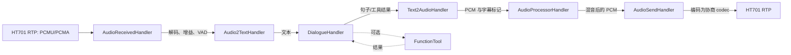
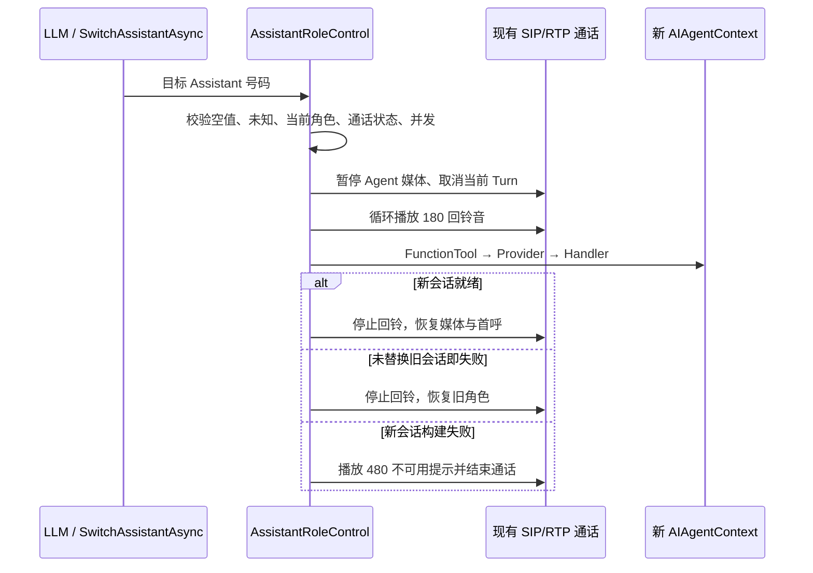

# 系统架构与音频流水线

Agent.Telephone 将传统模拟电话经 HT701 注册为 SIP 设备，并在一通 SIP/RTP 通话内运行语音 Agent。SIP 会话与 Agent 角色是不同生命周期：切换角色时保留 SIP dialogue、`SIPUserAgent`、RTP 媒体会话和设备身份，只重建 Agent 会话。

## 总体分层

```text
模拟电话 ─ FXS ─ HT701 ── SIP 注册 / INVITE ──> Protocol / SIP Handlers
                                   │
                                   └── RTP (PCMU / PCMA)
                                            │
                                            ▼
Handlers  ─────> Providers ─────> Resources
编排数据流         统一能力          模型、编码、缓存、播放
     ▲                  ▲
     └──── Management：注册、选择、构建、所有权和释放 ────┘

Abstractions：配置、公共契约、结果类型、持久化接口、FunctionTool 能力接口
```

| 层 | 职责 | 不应承担的职责 |
| --- | --- | --- |
| `Management` | 注册 DI、按配置选择实现、构建/释放通话级对象、管理设备和通话。 | 具体云厂商协议或音频算法。 |
| `Handlers` | 消费 `Workflow<T>`、通过 Channel 转发数据、响应 SIP/AI 事件。 | 直接加载模型或拼装厂商 HTTP 请求。 |
| `Providers` | 暴露 `IVad`、`IAsr`、`ILlm`、`ITts`、`IAudioProcessor` 等统一能力。 | 无归属的通话状态机。 |
| `Resources` | ONNX 模型、FFmpeg 编解码、音频缓存、提示音播放等可复用底层机制。 | 角色切换、业务路由。 |
| `FunctionTools` | 将窄的业务能力暴露给 LLM，并通过 Adapter 访问公开契约。 | 直接操作 SIP/RTP 或具体 Call Controller。 |

## 通话上下文与所有权

```text
DeviceContext（已注册的网关设备）
└── ActiveCallContext（至多一个活动电话）
    ├── SIPUserAgent + VoIPMediaSession
    ├── CallToken：整通电话的取消令牌
    ├── 协商的音频格式与 ptime
    └── AIAgentContext（当前角色）
        ├── Provider、FunctionTool、HandlerPipeline
        ├── Token：当前对话 Turn 的取消令牌
        └── 历史、DTMF/电话交互、提示音播放状态
```

- `CallToken` 只在挂断、服务停止或通话终止时取消。
- Turn Token 在用户抢话、角色切换等场景取消；不能把它误当成整通电话结束。
- 跨异步任务使用现有 `TryAcquireUse`/lease 机制持有通话。资源必须由正确的通话或 Agent 会话所有者逆序、可重复地释放。
- 每个 Channel 消费者、回铃循环、TTS/LLM 外部请求都必须响应对应取消令牌；正常取消不应被记录成系统故障。

## 音频与 AI 数据流



1. `AudioReceivedHandler` 接收 RTP，解码 PCMU/PCMA，重采样为模型输入，按 VAD 语音边界产生音频 Workflow。
2. `Audio2TextHandler` 将一句音频交给 ASR，得到用户文本；空数据、结束帧与取消必须正确传播。
3. `DialogueHandler` 维护当前 Turn，调用 Intent/LLM；工具调用、历史与离线回复持久化在此链路协作。
4. `Text2AudioHandler` 按句将 LLM 输出送入 TTS，并把流式 PCM、句子开始/结束标记送往后续处理。
5. `AudioProcessorHandler` 将 TTS、系统提示音等音频交给混音器；`AudioSendHandler` 依据协商 codec 编码并经 RTP 发回电话。

提示音也走音频处理器：嵌入式提示音先被缓存为 8 kHz PCM，再按当前通话的采样率重采样、混音并输出。不能因为本地 MP3 能播放就假定电话链路正确；采样率、声道、位深、codec 与 ptime 必须以 SDP 协商结果为准。

## 首次接通、抢话与取消

```text
INVITE
  → 创建 ActiveCallContext / AIAgentContext
  → FunctionToolManager → ProviderManager → HandlerManager
  → 首呼提示音与 HelloMessage TTS（若配置有效）
  → 恢复用户输入，进入正常对话

用户讲话打断输出
  → 取消当前 Turn
  → 清理旧输出/混音缓冲
  → 新语音进入 ASR 与新的 Turn
```

首次构建顺序是 FunctionTool、Provider、Handler。后两者可能依赖前者已注册的通话级能力；任一步失败都应清理本次已创建、尚未转移所有权的对象。

## 同一通话内的角色切换



因此“转接”不是新 SIP 呼叫。实现扩展时不得重新创建 `SIPUserAgent` 或 `VoIPMediaSession`，也不得让旧角色的 TTS 在新角色就绪后继续输出。

## 新增组件的检查表

新增 Provider、Handler 或 Resource 时，至少确认：

1. 接口位于恰当层级，消费者依赖抽象而非具体实现。
2. DI 注册、Manager 构建、配置键和失败清理路径完整。
3. 输入/输出 Workflow 类型、Channel 所有权、结束帧和对象池归还路径清晰。
4. 取消、抢话、挂断和角色切换不会留下后台循环或播放任务。
5. 对应单元测试不依赖真实云服务、HT701 或生产密钥。
