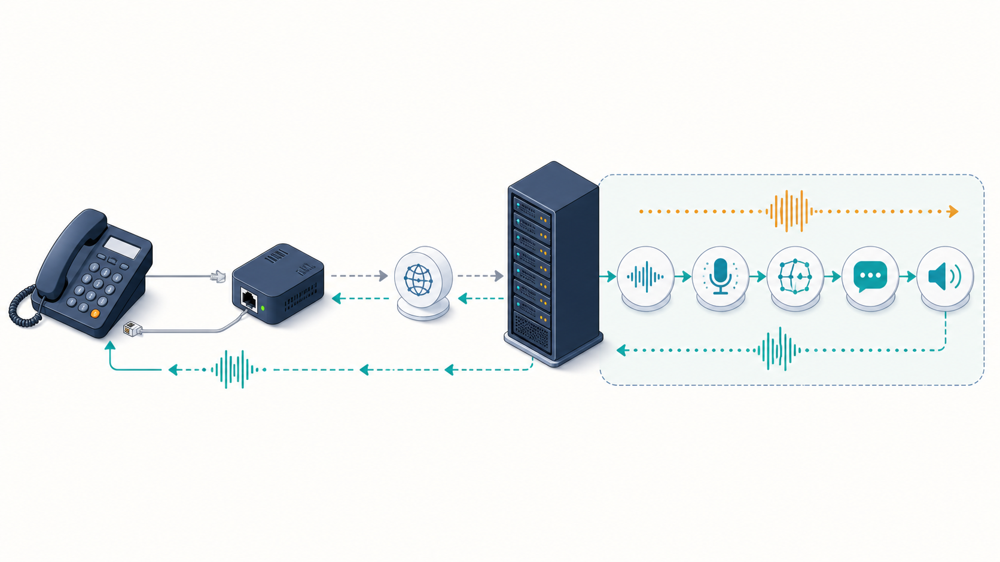
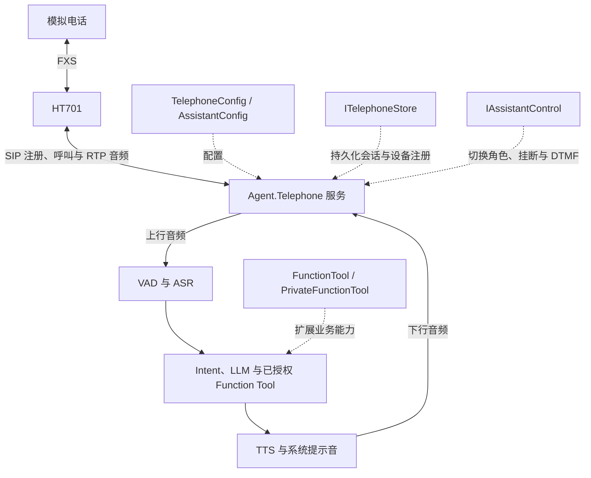
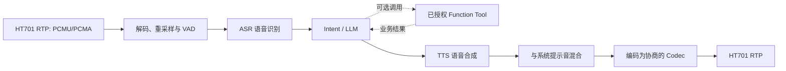
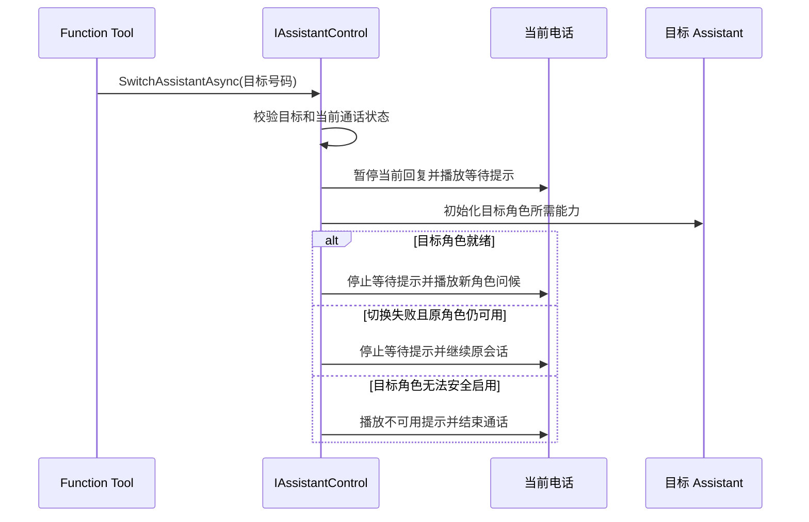

# 🧭 系统架构与音频流水线

Agent.Telephone 将传统模拟电话经 HT701 注册为 SIP 设备，并在一通 SIP/RTP 通话内提供语音 Agent。开发者需要关注的是公开配置、扩展接口和可观察的通话行为：切换 Assistant 时会保留当前电话连接，只更换当前角色及其能力。



> 🎨 图示用于帮助理解业务数据流；具体配置项和公开接口分别以配置参考与 API 定义为准。

## 🧱 对外能力概览



开发者可使用的主要入口如下：

| 公开入口 | 用途 |
| --- | --- |
| `TelephoneConfig`、`SIPConfig`、`ModelConfig`、`AssistantConfig` | 配置 SIP 服务、模型能力、Assistant 号码、提示词和工具授权。 |
| `IServerBuilder` | 初始化服务，并注册 Function Tool 等扩展。 |
| `FunctionTool`、`PrivateFunctionTool` | 向 LLM 提供受 `AllowedTools` 限制的业务函数。 |
| `IAssistantControl` | 在私有工具中读取当前通话状态、切换 Assistant、挂断或请求 DTMF 输入。 |
| `ITelephoneStore` | 替换会话、留言和设备注册的持久化实现。 |

SDK 如何组织音频处理、对象所有权和内部组件不属于公共契约；二开代码不应依赖这些实现细节。

## 🧩 通话与 Assistant 生命周期

```text
已注册的网关设备
└── 当前活动电话（同一设备同一时刻至多一通）
    ├── SIP/RTP 连接与协商后的音频格式
    ├── 当前 Assistant 配置
    └── 当前一轮对话、已授权工具与回复播放
```

- 挂断、服务停止或电话异常结束会终止整通电话。
- 用户抢话或切换 Assistant 会取消当前一轮回复，但不等于重新建立电话连接。
- `FunctionTool` 的异步工作应响应收到的 `CancellationToken`；正常取消不应被当作业务成功，也不应产生未受控的后台任务。
- 角色切换、回拨和留言等场景的可观察状态应通过 `AssistantSwitchResult`、`DtmfInputResult` 和 `ITelephoneStore` 契约处理。

## 🎧 音频与 AI 数据流



1. HT701 通过 RTP 发送 PCMU/PCMA 音频；服务解码、重采样，并使用 VAD 判断有效语音边界。
2. ASR 将用户语音转为文本，随后由所配置的 Intent/LLM 处理。
3. 当前 Assistant 只能调用其 `AllowedTools` 中已授权的工具。
4. LLM 文本交给 TTS，合成音频可与回铃、错误或菜单提示音一起输出。
5. 服务按照 SDP 协商的采样格式、Codec 与 `ptime` 编码并经 RTP 发回电话。

不能因为本地音频文件可以播放就假定电话链路正确；采样率、声道、位深、Codec 与 `ptime` 必须以实际协商结果为准。

## ⚡ 首次接通、抢话与取消

```text
INVITE
  → 校验设备注册、被叫号码与 Assistant 配置
  → 初始化所选语音能力和已授权工具
  → 播放号码/服务提示与 HelloMessage TTS（若配置有效）
  → 开始正常对话

用户讲话打断输出
  → 取消当前回复
  → 停止尚未播放完的旧输出
  → 新语音进入 ASR 与下一轮对话
```

如果 Assistant 初始化失败或超过 `SIPConfig.AgentInitializationTimeoutSeconds`，呼叫会按失败场景结束或播放不可用提示。开发者只需保证模型资源、外部凭据和工具依赖在接通前可用，无需依赖 SDK 内部的初始化顺序。

## 🎭 同一通话内的角色切换



“转接”不是新 SIP 呼叫：用户不会收到第二次来电，也不需要重新接听。调用方应根据 `AssistantSwitchResult.Status` 处理无效目标、未知角色、当前角色、通话结束和失败等结果，不要轮询或重复触发切换。

## ✅ 公共扩展检查表

新增 Assistant、Function Tool 或存储实现时，至少确认：

1. Assistant 引用的模型配置键、Prompt、首次问候和 `AllowedTools` 均有效。
2. 工具通过 `WithFunctionTools<T>()`、`WithPrivateFunctionTools<T>()` 或公开 DI 契约完成注册，只暴露必要的 `public` 方法。
3. 需要工具调用或 DTMF 的角色使用 `FunctionCall`，并正确处理超时、取消和通话结束状态。
4. 外部请求、子进程和后台任务响应 `CancellationToken`，不会因抢话、切换或挂断继续产生副作用。
5. 自定义 `ITelephoneStore` 保持消息身份、状态变迁、排序和清理语义，并为主要业务场景补充测试。

上一篇：[02-配置文件参考.md](02-配置文件参考.md)<br />
下一篇：[04-FunctionTool与按键交互扩展.md](04-FunctionTool与按键交互扩展.md)
