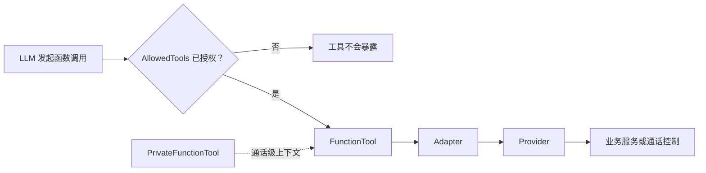

# 🧰 FunctionTool 与按键交互扩展

本章面向需要为 Assistant 增加业务能力的开发者。FunctionTool 的公开方法会被转换为 LLM 可调用的函数；是否真的提供给某个 Assistant，仍由该 Assistant 的 `AllowedTools` 决定。

> 本文基于当前工作区源码。长任务可复用已有的“挂断后完成并回拨/留言”对话生命周期；除非新增了对应的公共契约与测试，Private Function Tool 不应自行引入电话审批或回拨问答机制。



*图：LLM 只能调用被当前 Assistant 授权的工具；工具经 Adapter 访问 Provider，而非直接操作 SIP。*

## 🧩 1. 选择工具类型

| 类型 | 注册方式 | 生命周期 | 适用场景 | 可用上下文 |
| --- | --- | --- | --- | --- |
| `FunctionTool` | `WithFunctionTools<T>()` | 进程级单例；服务停止时释放 | 无通话状态的通用能力，例如读取服务器时间 | `Logger`、`ServerInfo` |
| `PrivateFunctionTool` | `WithPrivateFunctionTools<T>()` | 每个活动通话/当前 Assistant 会话创建并由会话释放 | 挂断、角色切换、与来电者相关的查询或临时资源 | 以上能力，以及 `DeviceContext`、`CallControl` |

`WithFunctionTools<T>()` 要求类型具有无参构造函数，因此不要把需要 DI 构造注入的业务依赖放进全局工具。全局工具必须自行保证并发安全，不能保存某个来电者、当前 SIP 会话或本次 Turn 的可变状态。

`WithPrivateFunctionTools<T>()` 以 Transient 方式注册，支持构造注入，适合持有通话级状态或客户端连接。工具管理器只会初始化当前 Assistant 被授权的方法；没有任何已授权方法的私有工具不会加入该通话的生命周期。释放时依次调用 `OnDeviceClosedAsync`、`OnFunctionToolReleasedAsync`，并在实现了 `IDisposable` 时调用 `Dispose`，因此应在这些位置取消后台任务、释放连接和临时资源。

所有 **public 实例方法** 都会被扫描为候选函数（属性访问器和基类方法除外）。辅助方法请设为 `private` 或 `internal`，不要误暴露给 LLM。

## 🔐 2. 注册、授权与生命周期

示例宿主在初始化后注册工具。全局工具使用无参构造；私有工具可以通过构造函数取得由宿主注册的依赖。

```csharp
serverBuilder.Initialize(config, messageStore);
serverBuilder.HostBuilder.ConfigureServices((_, services) =>
{
    services.AddTransient<IOrderService, OrderService>();
});

serverHost = serverBuilder
    .WithFunctionTools<GetTime>()
    .WithPrivateFunctionTools<ConfirmOrderTool>()
    .Build();
```

至少为工具方法添加 `Description`，为每个参数添加说明。方法名是默认函数名。`FunctionReturn<T>` 用于把业务结果和电话侧后续动作分开：

- `Result`：函数的业务结果。
- `Response`：需要播报给电话用户的文本。
- `Next`：本次调用覆盖默认动作；为空时回退到 `ToolBehaviorAttribute.DefaultAction`。

`ToolAction` 的语义如下：

| 动作 | 适用场景 |
| --- | --- |
| `Continue` | 让 LLM 根据工具结果继续组织自然语言回复。 |
| `DirectResponse` | 直接播报 `Response`，适合查询结果和明确的成功/失败提示。 |
| `Silent` | 不追加播报，适合已挂断、已启动角色切换等操作。 |

`ToolBehaviorAttribute.AllowIntentDetection` 是当前公共属性，但当前工具注册与调用路径没有以它作为授权开关；不要把它当作安全控制。Assistant 的实际授权边界仍应由 `AllowedTools` 维护。

配置中的授权应尽量写方法名，只授予最小能力：

```jsonc
{
  "Intent": "FunctionCall",
  "AllowedTools": [
    "ConfirmOrderAsync"
  ]
}
```

当前实现也接受工具类名或工具类全名作为 `AllowedTools` 值；这会授权该类的全部公开工具方法，除非确有需要，不建议使用。启动时会校验每个 `AllowedTools` 条目是否匹配已注册工具；不存在的名称会导致工具构建失败。

现有示例可作为边界参考：`GetTime` 是全局工具；`GetWeather` 是带按键确认的私有工具；`HangupCall` 经 `CallControl.HangupCurrentCall()` 结束通话；`AssistantSwitch` 经 `CallControl.SwitchAssistantAsync()` 在原有 SIP/RTP 通话中切换角色。工具不得直接操作 `SIPUserAgent`、RTP 会话或具体 Call Controller。

## 🧪 3. 最小工具示例

无通话状态的全局工具可以像示例项目的 `GetTime` 一样实现。由于它会以单例形式复用，下面的实现没有保存每次调用的状态：

```csharp
using System.ComponentModel;
using Agent.Telephone.Abstractions.Common.Attributes;
using Agent.Telephone.Abstractions.Common.Contexts;
using Agent.Telephone.Abstractions.Common.Enums;
using Agent.Telephone.FunctionTools;

public sealed class GetTimeTool : FunctionTool
{
    [Description("获取服务器当前日期和时间。")]
    [ToolBehavior(ToolAction.DirectResponse)]
    public FunctionReturn<DateTimeOffset> GetCurrentTime()
    {
        DateTimeOffset now = DateTimeOffset.Now;
        return new FunctionReturn<DateTimeOffset>
        {
            Result = now,
            Response = $"当前时间是 {now:yyyy-MM-dd HH:mm:ss}。",
        };
    }
}
```

下面的私有工具需要确认订单后才能提交。业务服务 `IOrderService` 由宿主 DI 注册；示例省略其领域实现。

```csharp
using System.ComponentModel;
using Agent.Telephone.Abstractions.Common.Attributes;
using Agent.Telephone.Abstractions.Common.Contexts;
using Agent.Telephone.Abstractions.Common.Enums;
using Agent.Telephone.FunctionTools;

public sealed class ConfirmOrderTool : PrivateFunctionTool
{
    private readonly IOrderService _orders;

    public ConfirmOrderTool(IOrderService orders)
    {
        this._orders = orders;
    }

    [Description("在来电者确认后提交指定订单。")]
    [ToolBehavior(
        ToolAction.DirectResponse,
        DtmfKeys = DtmfKey.One | DtmfKey.Two,
        DtmfPrompt = "确认提交请按 1，取消请按 2。")]
    public async Task<FunctionReturn<string>> ConfirmOrderAsync(
        [Description("待提交的订单编号。")] string orderId,
        DtmfInputResult dtmfInput,
        CancellationToken cancellationToken = default)
    {
        if (dtmfInput.Status != DtmfInputStatus.Accepted ||
            dtmfInput.SelectedKey != DtmfKey.One)
        {
            string response = dtmfInput.Status == DtmfInputStatus.TimedOut
                ? "确认超时，订单未提交。"
                : "已取消提交订单。";
            return new FunctionReturn<string>
            {
                Result = "cancelled",
                Response = response,
            };
        }

        await this._orders.SubmitAsync(orderId, cancellationToken);
        return new FunctionReturn<string>
        {
            Result = "submitted",
            Response = $"订单 {orderId} 已提交。",
        };
    }
}
```

此方法需要同时完成四项配置：注册 `WithPrivateFunctionTools<ConfirmOrderTool>()`、在目标 Assistant 的 `AllowedTools` 中加入 `ConfirmOrderAsync`、将 Assistant 的 `Intent` 配置为引用 `Type: FunctionCall` 的 Intent 项、保证该 Assistant 可使用 DTMF 的电话链路。不要让 LLM 把按键结果作为参数传入。

## 🔢 4. DTMF 按键确认的工作方式

当 `ToolBehavior` 同时声明 `DtmfKeys` 和 `DtmfPrompt` 时，工具管理器会：

1. 将 `DtmfInputResult` 从 LLM 的参数 Schema 中隐藏。
2. 在函数调用前播放 `DtmfPrompt`，开启一次按键窗口。
3. 把系统取得的 `DtmfInputResult` 注入到该参数，再执行实际方法。

运行时只接受 `0`–`9`、`*` 和 `#`。每个按键窗口默认等待 15 秒；同一通话同一时刻只能等待一组按键。并发请求不会打断先前窗口，而会得到 `AlreadyWaiting`。Turn 被取消、角色切换或通话结束会取消等待，因此业务方法必须检查 `Status`，不能把“没有按 1”一律视为用户拒绝。

允许状态包括 `Accepted`、`TimedOut`、`InvalidKey`、`AlreadyWaiting`、`CallEnded` 和 `Unavailable`。示例把 `1` 作为确认，`2` 和其它结果视为取消；实际业务应明确每个按键和超时的语义。

启动校验会拒绝以下定义：

- 声明了 `DtmfKeys` 却没有**恰好一个** `DtmfInputResult` 参数。
- 声明了按键结果或 `DtmfPrompt`，却没有 `DtmfKeys`。
- 没有 `DtmfPrompt`，或包含不受支持的按键。
- Assistant 授权了 DTMF 工具，却没有配置为 `FunctionCall` Intent。

建议为同一 Assistant 的危险操作分配互不重叠、语义稳定的按键，并在真实 HT701 上验证 RFC2833/DTMF 传递、超时、挂断和抢话后的取消行为。

## ⏳ 5. `10088` Codex 长任务工具

示例宿主的 `CodexAssistant` 是无构造依赖的 `PrivateFunctionTool`。它只负责将明确任务作为一个参数传给 `codex exec --ephemeral`，同时持续读取 stdout/stderr，避免子进程缓冲阻塞。stdout 的最终消息会作为工具结果交还当前 LLM；stderr 仅被消费以避免阻塞，不会写入电话回复或日志。

调用方法接受当前 Turn 的 `CancellationToken`：用户新说话、角色切换或服务停止会终止子进程；普通 SIP 挂断不会取消该 Turn。`DialogueHandler` 会在任务完成时把已经离线的回复写为未读消息，并使用既有回拨/留言流程投递。

当前版本刻意不包含等待音、电话 DTMF 审批、运行中追问、Codex Thread 恢复或写入沙箱。任务应在开始前就足够明确，并适合只读、非交互执行。需要这些能力时，应单独设计双向协议、权限与回拨生命周期，不能在工具中临时拼接。

## ✅ 6. 二开检查清单

- 方法与参数的 `Description` 是否能让模型在正确场景调用，且不会泄漏密钥或用户隐私？
- 是否只在 `AllowedTools` 中授权实际需要的 Assistant？
- 私有工具的构造依赖是否可由 DI 创建，后台进程是否同时持续消费 stdout/stderr，并能响应当前 Turn 的取消？
- 是否为每个 `ToolAction`、异常、取消、通话结束和 DTMF 超时编写最小测试？
- 是否避免让工具实现直接依赖 SIP/RTP 实现类型，并避免在全局工具中保存通话状态？
