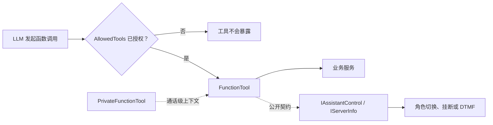
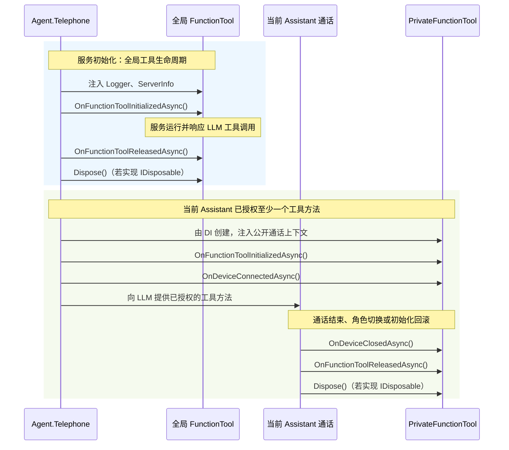

# 🧰 FunctionTool 与按键交互扩展

本章面向需要为 Assistant 增加额外扩展能力的开发者。

继承了 `FunctionTool` / `PrivateFunctionTool` 的子类，其所有 **public 实例方法** 都会被转换为 LLM 可调用的函数（属性访问器和基类方法除外）。辅助方法请设为 `private` 或 `internal`，不要误暴露给 LLM。

而是否真的提供给某个 Assistant，仍由该 Assistant 的 `AllowedTools` 决定。




*图：LLM 只能调用被当前 Assistant 授权的工具；通话相关能力通过公开契约访问。*

## 🧩 1. 选择工具类型

| 类型 | 注册方式 | 生命周期 | 适用场景 | 可用上下文 |
| --- | --- | --- | --- | --- |
| `FunctionTool` | `WithFunctionTools<T>()` | 进程级单例；服务停止时释放 | 无通话状态的通用能力，例如读取服务器时间 | `Logger`、`ServerInfo` |
| `PrivateFunctionTool` | `WithPrivateFunctionTools<T>()` | 每个活动通话/当前 Assistant 会话创建并由会话释放 | 挂断、角色切换、与来电者相关的查询或临时资源 | 以上能力，以及 `DeviceContext`、`CallControl` |

`WithFunctionTools<T>()` 要求类型具有无参构造函数，因此不要把需要 DI 构造注入的业务依赖放进全局工具。全局工具必须自行保证并发安全，不能保存某个来电者、当前 SIP 会话或本次 Turn 的可变状态。

`WithPrivateFunctionTools<T>()` 以 Transient 方式注册，但当前 API 带有 `new()` 约束，因此只适用于具有无参构造函数的工具。需要构造注入的私有工具应通过 `ConfigureServices` 显式注册为 `IPrivateFunctionTool`。SDK 只会初始化当前 Assistant 被授权的方法；没有任何已授权方法的私有工具不会加入该通话的生命周期。

### 生命周期虚方法：触发时机与职责

以下回调默认均为空实现。它们不是 LLM 可调用函数，不会被扫描为工具方法；应只用于建立或清理工具自身的资源。回调抛出异常会使对应的服务构建或通话级初始化失败，因此清理逻辑应具有幂等性。

<table>
  <thead>
    <tr><th>基类</th><th>虚方法</th><th>何时触发</th><th>作用与实现建议</th></tr>
  </thead>
  <tbody>
    <tr>
      <td rowspan="2"><code>FunctionTool</code></td>
      <td><code>OnFunctionToolInitializedAsync()</code></td>
      <td>
        全局工具：服务 <code>Build()</code> 期间，<code>Logger</code>、<code>ServerInfo</code> 已注入且方法元数据已提取后，开始接受电话前调用。<br />
        私有工具：当前通话所需工具初始化期间，<code>Logger</code>、<code>ServerInfo</code>、<code>DeviceContext</code>、<code>CallControl</code> 已注入后，在 <code>OnDeviceConnectedAsync()</code> 之前调用。
      </td>
      <td>初始化长生命周期资源，例如读取只读配置、创建客户端或启动受控后台任务。私有工具不得在此假定其方法已经暴露给 LLM。</td>
    </tr>
    <tr>
      <td><code>OnFunctionToolReleasedAsync()</code></td>
      <td>
        全局工具：服务停止释放工具，或工具初始化失败需要回滚时调用。<br />
        私有工具：当前 Assistant 通话释放工具时，在 <code>OnDeviceClosedAsync()</code> 之后、<code>IDisposable.Dispose()</code> 之前调用；通话结束、角色切换或通话级初始化回滚都会进入该路径。
      </td>
      <td>释放与工具实例绑定的资源，例如停止后台任务、关闭客户端连接、归还租约。不要在此继续访问已经结束的通话能力；即使初始化只完成了一部分也必须可安全执行。</td>
    </tr>
    <tr>
      <td rowspan="2"><code>PrivateFunctionTool</code></td>
      <td><code>OnDeviceConnectedAsync()</code></td>
      <td>仅私有工具。在该工具通过当前 Assistant 的 <code>AllowedTools</code> 筛选、完成基础初始化后，且当前 <code>DeviceContext</code> 与 <code>CallControl</code> 可用时调用；早于该工具方法向 LLM 暴露。</td>
      <td>建立与本次电话绑定的状态，例如订阅设备事件、打开会话级连接或准备临时目录。应使用通话的取消/结束状态，并避免阻塞接通流程。</td>
    </tr>
    <tr>
      <td><code>OnDeviceClosedAsync()</code></td>
      <td>仅私有工具。当当前 Assistant 通话释放工具时最先调用；常见原因是通话挂断或切换 Assistant，也会在已初始化工具的后续构建失败时作为回滚执行。</td>
      <td>撤销 <code>OnDeviceConnectedAsync()</code> 建立的通话级资源，例如取消事件订阅、停止通话后台任务或关闭临时会话。它之后仍会调用 <code>OnFunctionToolReleasedAsync()</code>，因此两者不要重复释放同一资源而报错。</td>
    </tr>
  </tbody>
</table>

回调顺序如下；未被当前 Assistant 授权的私有工具不会进入该流程：



## 🔐 2. 注册、授权与生命周期

示例宿主在初始化后注册工具。全局工具使用无参构造；需要构造注入的私有工具通过 DI 显式注册。

```csharp
serverBuilder.Initialize(config, messageStore);
serverBuilder.HostBuilder.ConfigureServices((_, services) =>
{
    services.AddTransient<IOrderService, OrderService>();
    services.AddTransient<IPrivateFunctionTool, ConfirmOrderTool>();
});

serverHost = serverBuilder
    .WithFunctionTools<GetTime>()
    .Build();
```

建议至少为工具方法添加 `Description` 特性，为每个参数添加说明。方法名是默认函数名。`FunctionReturn<T>` 用于把业务结果和电话逻辑端后续动作分开：

- `Result`：函数的业务结果。
- `Response`：需要播报给电话用户的文本。
- `Next`：本次调用覆盖默认动作；为空时回退到 `ToolBehaviorAttribute.DefaultAction`。

`ToolAction` 的语义如下：

| 动作 | 适用场景 |
| --- | --- |
| `Continue` | 让 LLM 根据工具结果继续组织自然语言回复。 |
| `DirectResponse` | 直接播报 `Response`，适合查询结果和明确的成功/失败提示。 |
| `Silent` | 不追加播报，适合已挂断、已启动角色切换等操作。 |


配置中的授权应尽量写方法名，只授予最小能力：

```jsonc
{
  "Intent": "FunctionCall",
  "AllowedTools": [
    "ConfirmOrderAsync"
  ]
}
```

### 方法授权与类授权

`AllowedTools` 除了接受工具方法名，也接受 **工具类名** 或 **工具类全名**。

类名授权不是把类实例交给 LLM，而是让工具管理器把该类中匹配的每个方法分别包装为 LLM 函数。启动时会校验每个 `AllowedTools` 条目是否匹配已注册工具；不存在的名称会导致工具构建失败。

“可扫描的方法”是工具类**直接声明**的 `public` 实例方法：属性/事件访问器、`static` 方法和 `FunctionTool` / `PrivateFunctionTool` 的继承方法不会被暴露；从其他自定义基类继承的方法同样不会被扫描。

`OnFunctionToolInitializedAsync`、`OnFunctionToolReleasedAsync`、`OnDeviceConnectedAsync`、`OnDeviceClosedAsync` 只是生命周期回调，不会成为 LLM 工具。

例如，以下工具有两个业务方法和一个辅助方法：

```csharp
public sealed class AccountTool : FunctionTool
{
    [Description("查询当前账户余额。")]
    public FunctionReturn<decimal> GetBalanceAsync() => throw new NotImplementedException();

    [Description("查询最近账单。")]
    public FunctionReturn<string> GetRecentInvoicesAsync() => throw new NotImplementedException();

    // 若保持 public，类名授权时它也会被 LLM 看到；应改为 private 或 internal。
    public string NormalizeAccountNumber(string accountNumber) => accountNumber.Trim();
}
```

对应授权效果如下：

```jsonc
// 仅提供余额查询。
{ "AllowedTools": ["GetBalanceAsync"] }

// 提供 AccountTool 直接声明的三个 public 实例方法，包含不应暴露的 NormalizeAccountNumber。
{ "AllowedTools": ["AccountTool"] }

// 与上一项范围相同；完整类型名用于消除类名歧义。
{ "AllowedTools": ["MyCompany.Telephone.Tools.AccountTool"] }
```

| `AllowedTools` 值 | 授权范围 | 使用建议 |
| --- | --- | --- |
| `GetBalanceAsync` | 仅授权同名方法；若多个工具类定义了相同方法名，会匹配到它们。 | 默认选择，最符合最小权限原则。 |
| `AccountTool` | 授权 `ConfirmOrderTool` **类**中所有可扫描的方法。 | 仅在该类中的方法本来就应整体暴露时使用。 |
| `MyCompany.Telephone.Tools.AccountTool` | 与类名授权范围相同，但按完整类型名匹配。 | 工具类可能重名时使用，配置意图更明确。 |

因此，使用类名授权后，未来新增 `public` 实例方法会自动扩大该 Assistant 的可调用能力，辅助方法应设为 `private` 或 `internal`。

现有示例中可作为参考：

1. `GetTime` 是全局工具；
2. `GetWeather` 是带按键确认的私有工具；
3. `HangupCall` 经 `CallControl.HangupCurrentCall()` 结束通话；
4. `AssistantSwitch` 经 `CallControl.SwitchAssistantAsync()` 在原有 SIP/RTP 通话中切换角色。

## 🧪 3. 最小工具示例

无通话状态的全局工具可以像示例项目的 `GetTime` 一样实现。由于它会以单例形式复用，下面的实现没有保存每次调用的状态：

```csharp
using System.ComponentModel;
using Agent.Telephone.Abstractions.Common.Attributes;
using Agent.Telephone.Abstractions.Common.Contexts;
using Agent.Telephone.Abstractions.Common.Enums;
using Agent.Telephone.FunctionTools;

public sealed class GetTimeTool : FunctionTool
{
    [Description("获取服务器当前日期和时间。")]
    [ToolBehavior(ToolAction.DirectResponse)]
    public FunctionReturn<DateTimeOffset> GetCurrentTime()
    {
        DateTimeOffset now = DateTimeOffset.Now;
        return new FunctionReturn<DateTimeOffset>
        {
            Result = now,
            Response = $"当前时间是 {now:yyyy-MM-dd HH:mm:ss}。",
        };
    }
}
```

下面的私有工具需要确认订单后才能提交。业务服务 `IOrderService` 由宿主 DI 注册；示例省略其领域实现。

```csharp
using System.ComponentModel;
using Agent.Telephone.Abstractions.Common.Attributes;
using Agent.Telephone.Abstractions.Common.Contexts;
using Agent.Telephone.Abstractions.Common.Enums;
using Agent.Telephone.FunctionTools;

public sealed class ConfirmOrderTool : PrivateFunctionTool
{
    private readonly IOrderService _orders;

    public ConfirmOrderTool(IOrderService orders)
    {
        this._orders = orders;
    }

    [Description("在来电者确认后提交指定订单。")]
    [ToolBehavior(
        ToolAction.DirectResponse,
        DtmfKeys = DtmfKey.One | DtmfKey.Two,
        DtmfPrompt = "确认提交请按 1，取消请按 2。")]
    public async Task<FunctionReturn<string>> ConfirmOrderAsync(
        [Description("待提交的订单编号。")] string orderId,
        DtmfInputResult dtmfInput,
        CancellationToken cancellationToken = default)
    {
        if (dtmfInput.Status != DtmfInputStatus.Accepted ||
            dtmfInput.SelectedKey != DtmfKey.One)
        {
            string response = dtmfInput.Status == DtmfInputStatus.TimedOut
                ? "确认超时，订单未提交。"
                : "已取消提交订单。";
            return new FunctionReturn<string>
            {
                Result = "cancelled",
                Response = response,
            };
        }

        await this._orders.SubmitAsync(orderId, cancellationToken);
        return new FunctionReturn<string>
        {
            Result = "submitted",
            Response = $"订单 {orderId} 已提交。",
        };
    }
}
```

此方法需要同时完成四项配置：通过 DI 注册 `IPrivateFunctionTool` 到 `ConfirmOrderTool`、在目标 Assistant 的 `AllowedTools` 中加入 `ConfirmOrderAsync`、将 Assistant 的 `Intent` 配置为引用 `Type: FunctionCall` 的 Intent 项、保证该 Assistant 可使用 DTMF 的电话链路。不要让 LLM 把按键结果作为参数传入。

## 🔢 4. DTMF 按键确认的工作方式

当 `ToolBehavior` 同时声明 `DtmfKeys` 和 `DtmfPrompt` 时，SDK 会在调用工具方法前：

1. 将 `DtmfInputResult` 从 LLM 的参数 Schema 中隐藏。
2. 在函数调用前播放 `DtmfPrompt`，开启一次按键窗口。
3. 把系统取得的 `DtmfInputResult` 注入到该参数，再执行实际方法。

运行时只接受 `0`–`9`、`*` 和 `#`。每个按键窗口默认等待 **15** 秒；同一通话同一时刻只能等待一组按键。并发请求不会打断先前窗口，而会得到 `AlreadyWaiting`。Turn 被取消、角色切换或通话结束会取消等待；当前默认实现会传播 `OperationCanceledException`，此时实际工具方法不会被调用。

### `DtmfInputStatus` 使用场景

`TimedOut`、`InvalidKey`、`AlreadyWaiting`、`Unavailable` 等状态**不会自动阻止**业务方法执行；危险操作必须先检查 `Status` 和 `SelectedKey`。`DtmfInputResult.Succeeded` 仅在 `Status == Accepted` 且存在 `SelectedKey` 时为 `true`。

| 状态 | 典型触发场景 | 框架后续行为 | 业务方法的推荐处理 |
| --- | --- | --- | --- |
| `Accepted` | 在等待窗口内收到当前工具 `DtmfKeys` 允许的按键。 | 注入 `SelectedKey`，再调用工具方法。 | 仍需判断具体按键：例如 `1` 是确认，`2` 是用户主动取消；只有 `Accepted` **且**为确认键时才执行敏感操作。 |
| `TimedOut` | 15 秒内没有收到允许的按键，且等待没有被取消。 | 注入结果后仍调用工具方法。 | 不执行操作；返回“确认超时，未处理”之类的明确结果。可由上层重新发起一次新的确认，但不要在原窗口继续等待。 |
| `InvalidKey` | 请求的键集合为空、包含不支持按键，或不是当前 Assistant 已授权 DTMF 工具所声明的键。 | 不创建等待窗口；若该结果由包装器取得，仍会调用工具方法。 | 视为配置或程序集成错误，不执行操作；记录诊断信息并检查 `ToolBehavior.DtmfKeys`、`AllowedTools` 与 `FunctionCall` 配置。 |
| `AlreadyWaiting` | 当前通话已在播放提示/等待按键，或已有尚未结束的 DTMF 窗口。 | 不创建第二个窗口；注入结果后仍调用工具方法。 | 不执行操作，也不要把它当成用户拒绝；提示稍后重试或让当前交互自然结束。 |
| `CallEnded` | 通话已经结束，或按键交互无法继续。取消也可能通过 `CancellationToken` 表达，因此不能假定一定会收到此状态。 | 不会提供有效按键。 | 始终中止操作，不再尝试播报、重试或等待。 |
| `Unavailable` | DTMF 能力尚未就绪、提示词/播放器不可用，或按键提示合成/播放失败。 | 不会成功开始按键窗口；若业务方法收到该结果，仍必须自行拒绝操作。 | 不执行操作；返回“当前无法完成按键确认”的失败结果，并检查 TTS、提示音播放和 Assistant 初始化日志。 |

下面的防御性判断适用于确认、扣款、下单、挂断等有副作用的工具：

```csharp
if (!dtmfInput.Succeeded || dtmfInput.SelectedKey != DtmfKey.One)
{
    return new FunctionReturn<string>
    {
        Result = "not-confirmed",
        Response = dtmfInput.Status == DtmfInputStatus.TimedOut
            ? "确认超时，操作未执行。"
            : "未获得有效确认，操作未执行。",
    };
}

// 只有收到确认键后才执行有副作用的业务操作。
await service.CommitAsync(cancellationToken);
```

启动校验会拒绝以下定义：

- 声明了 `DtmfKeys` 却没有**恰好一个** `DtmfInputResult` 参数。
- 声明了按键结果或 `DtmfPrompt`，却没有 `DtmfKeys`。
- 没有 `DtmfPrompt`，或包含不受支持的按键。
- Assistant 授权了 DTMF 工具，却没有配置为 `FunctionCall` Intent。

建议为同一 Assistant 的危险操作分配互不重叠、语义稳定的按键，并在真实 HT701 上验证 RFC2833/DTMF 传递、超时、挂断和抢话后的取消行为。

## ⏳ 5. Codex 长任务工具

示例宿主通过 `.WithCodexAssistant(options => ...)` 注册来自 `Agent.Telephone.Codex` 的构造注入式 `PrivateFunctionTool`。`RunCodexTaskAsync` 只把本次明确任务写入 App Server，不拼接电话聊天历史。首次调用创建 Thread；同一用户和 Assistant 的后续调用按已保存的 ID 发送 `thread/resume`，只有 `startNewTask: true` 才创建新 Thread。

扩展固定使用运行目录下的 `data/codex` 作为子进程工作目录和 App Server `cwd`。工具持续读取 stdout/stderr，避免子进程缓冲阻塞；stdout 的 JSON-RPC 事件用于立即保存 Thread ID、确认 Turn 完成并取得最终 assistant 文本，stderr 仅被排空，不会写入电话回复或日志。进程内的 Codex 调用串行执行，排队期间也响应取消。

调用方法接受当前 Turn 的 `CancellationToken`：用户新说话、角色切换或服务停止会终止子进程；普通 SIP 挂断不会取消该 Turn。任务完成时，如果用户已经离线，回复会写为未读消息，并使用既有回拨/留言流程投递。

当前版本支持跨来电续接 Codex Thread，但仍不包含等待音、电话 DTMF 审批、运行中追问或写入权限升级。任务应在开始前足够明确，并适合只读、非交互执行。完整行为与配置见 [Codex 任务助理配置指南](10-Codex助手.md)。

## ✅ 6. 二开检查清单

- 方法与参数的 `Description` 是否能让模型在正确场景调用，且不会泄漏密钥或用户隐私？
- 是否只在 `AllowedTools` 中授权实际需要的 Assistant？
- 私有工具的构造依赖是否可由 DI 创建，后台进程是否同时持续消费 stdout/stderr，并能响应当前 Turn 的取消？
- 是否为每个 `ToolAction`、异常、取消、通话结束和 DTMF 超时编写最小测试？
- 是否避免让工具实现直接依赖 SIP/RTP 实现类型，并避免在全局工具中保存通话状态？

上一篇：[03-系统架构与音频流水线.md](03-系统架构与音频流水线.md)<br />
下一篇：[05-持久化、回拨与离线留言.md](05-持久化、回拨与离线留言.md)
