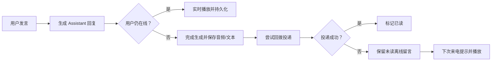
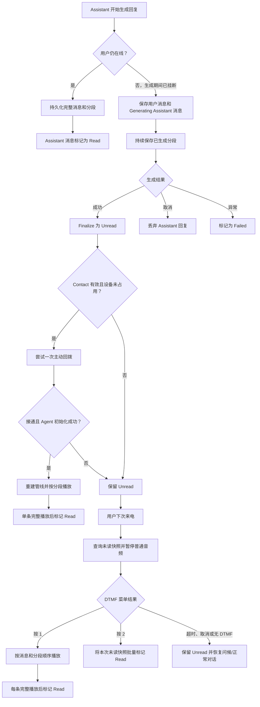

# 💾 持久化、回拨与离线留言

`ITelephoneStore` 是电话系统的持久化数据的抽象接口。

它负责保存通话历史、逐段回复、未读留言和 SIP 注册信息，使用户挂断后生成仍可继续，并在回拨失败时保留可在下次来电播放的留言。

示例宿主使用 `SqliteMessageStore`，数据库默认路径为 `./data/messages-db/messages.db`。生产环境可以替换为其他数据库，但必须保持本章的身份隔离、顺序、状态转换和取消语义。



*图：挂断会结束当前通话，但不会自动取消已开始的回复生成；结果会走回拨或离线留言分支。*

## 🧩 1. 数据模型与身份边界

一轮对话（Turn）至少包含两条完整消息：一条 `User` 消息和一条 `Assistant` 消息。它们共享 `TurnId`，但具有不同的 `Id`。Assistant 回复还可以拆为多个有序分段，便于在生成过程中持久化并逐段播放。

```text
ConversationMessage (完整语义记录)
  Id, TurnId, UserAor, AssistantNumber, Role
  FullText, State, CreatedAt, UpdatedAt, ReadAt
          1
          └── MessageSegment (播放/生成分段)
                Id, MessageId, Sequence, TextContent, AudioPath, CreatedAt
```

| 类型 | 关键字段 | 用途 |
| --- | --- | --- |
| `ConversationMessage` | `FullText`、`Role`、`DeliveryState` | 一整句用户输入或一次完整 Assistant 回复，用于历史、未读查询和状态管理。 |
| `MessageSegment` | `MessageId`、从 1 开始的 `Sequence`、`TextContent`、可选 `AudioPath` | Assistant 流式回复的句子/片段；按 `Sequence` 播放。用户消息通常也保存一个序号为 1 的分段。 |
| `DeviceRegistrationRecord` | `DeviceId`、`Aor`、`Contact`、注册和过期时间 | 重启恢复设备注册，以及在有效 Contact 上发起回拨。 |
| `MessageCleanupResult` | `ExpiredRemoved`、`OverflowRemoved` | 保留期和每会话上限清理的结果统计。 |

### 注意事项

1. 对话身份必须始终使用 **`UserAor + AssistantNumber`** 组合。
2. 只按来电号码会混淆不同角色的记忆和留言；
3. 只按设备 ID 会在注册变化或共享设备时混淆用户。
4. `GetMessageSegmentsAsync(messageId)` 本身没有身份参数来验证数据的归属方，只是通过消息Id来获取数据，因此自定义存储或上层 API 在读取前必须先通过带 `UserAor` 与 `AssistantNumber` 的消息查询做二次验证。

## 🔄 2. 消息状态与业务转换

`ConversationRole.User` 的消息只会以 `Read` 保存。Assistant 消息的状态机如下：

```text
创建 Assistant 消息
        │
        ▼
   Generating ── 成功且仍在线 ──► Read
        │
        ├── 成功但已挂断/离线 ──► Unread ── 播放完成或跳过 ──► Read
        │
        ├── 生成异常 ──────────► Failed
        │
        └── Turn 被取消/抢话 ──► Discard（删除 Assistant 消息及其分段）
```

`Failed` 不进入未读留言列表；`Discard` 仅移除 Assistant 回复和它的分段，保留用户问题。

`FinalizeAssistantMessageAsync` 只接受 `Read` 或 `Unread`，不能把一条已完成消息重新写成 `Generating` 或 `Failed`。

## 📚 3. `ITelephoneStore` 方法参考

| 方法 | 调用时机与要求 |
| --- | --- |
| `SaveConversationMessageAsync` | 新建完整用户/Assistant 消息。必须有非空 `Id`、`TurnId`、`UserAor`、`AssistantNumber`；用户消息必须是 `Read`。示例实现是插入，不是覆盖。 |
| `SaveMessageSegmentAsync` | 保存一个消息分段。`MessageId` 必须指向所属消息，`Sequence` 从 1 开始；读取时按序号排序。`AudioPath` 是可选缓存文件路径。 |
| `FinalizeAssistantMessageAsync` | 生成正常结束后更新全文和状态为 `Read` 或 `Unread`。在线播放完成写 `Read`，用户已挂断而需投递写 `Unread`。 |
| `FailAssistantMessageAsync` | LLM、TTS 或持久化流程发生业务失败后，保存已生成文本并转为 `Failed`。失败消息不可作为未读留言播放。 |
| `DiscardAssistantMessageAsync` | Turn 被新输入打断或取消时，原子删除该 Assistant 消息及全部分段；不删除同 Turn 的用户消息。 |
| `GetUnreadAssistantMessagesAsync` | 以 `(UserAor, AssistantNumber)` 查询 `Assistant + Unread`，按创建时间和 ID 排序，供下次来电菜单使用。 |
| `GetConversationMessagesAsync` | 读取指定用户与 Assistant 的完整历史，按创建时间和 ID 排序；不返回逻辑删除记录。 |
| `GetAssistantMessageAsync` | 以身份组合和 `messageId` 读取一条 Assistant 消息；回拨时轮询其生成状态和全文。 |
| `GetMessageSegmentsAsync` | 读取一条消息的全部分段，按 `Sequence` 排序；分段为空时，播放端回退到 `FullText`。 |
| `MarkAssistantMessageReadAsync` | 一条留言完整播放成功后标记 `Read`。 |
| `MarkAssistantMessagesReadAsync` | 对一个未读快照批量标记 `Read`，用于用户在留言菜单中选择“跳过/全部已读”。实现应使用单个事务并去重 ID。 |
| `CleanupConversationMessagesAsync` | 按传入时间清理过期记录和超过每个对话上限的旧记录，返回两类数量。不能影响设备注册。 |
| `SaveDeviceRegistrationAsync` | 收到 SIP REGISTER/刷新时保存或更新注册。`ExpiresAt` 必须晚于 `RefreshedAt`，以 `DeviceId` 做 upsert。 |
| `RemoveDeviceRegistrationAsync` | REGISTER 的过期值为 0，或启动恢复时发现无效记录时调用。实现可以物理删除或逻辑删除。 |
| `GetActiveDeviceRegistrationsAsync` | 启动恢复时取未删除且未过期的注册，让回拨可以解析最新 Contact。 |

所有方法都接受 `CancellationToken`。实现不得吞掉正常取消，也不应把 `CancellationToken` 替换为不可取消的无限等待。

## 🗃️ 4. 当前 SQLite 示例

`SqliteMessageStore` 使用三张电话业务主表：`ConversationMessages`、`MessageSegments`、`DeviceRegistrations`。

Codex 任务助理还在同一个默认数据库中创建 `CodexThreads` 表，以 `UserAor + AssistantNumber` 为主键保存当前 Thread ID。该表不保存任务正文或电话聊天记录，也不替代对话/留言表；Codex 的最终结果仍与普通 Assistant 回复一样进入既有投递流程。修改默认数据库位置时，必须让 `SqliteMessageStore` 与 `CodexThreadStore` 使用同一路径。详见 [Codex 任务助理配置指南](10-Codex助手.md)。

示例实现的重要约束：

- 对话消息查询索引包含 `UserAor`、`AssistantNumber`、角色、状态、逻辑删除和创建时间；分段索引为 `(MessageId, Sequence)`。
- `DiscardAssistantMessageAsync` 与批量已读、清理操作使用事务，避免消息与分段不一致。
- `UseLogicalDelete` 影响清理和设备注销是打标还是物理删除；查询必须统一排除 `IsDelete = 1`。
- `RetentionDays` 和 `MaxMessagesPerConversation` 控制清理；示例宿主启动时执行一次 `CleanupConversationMessagesAsync`。
- 时间以 round-trip 格式存储和读取。替换存储时必须统一使用含时区的 `DateTimeOffset`。

最小接入方式是在构建器初始化前创建存储：

```csharp
SqliteMessageStore store = new(new SqliteMessageStoreOptions
{
    DatabasePath = "./data/messages-db/messages.db",
    RetentionDays = 30,
    MaxMessagesPerConversation = 100,
    UseLogicalDelete = true,
});

await store.CleanupConversationMessagesAsync(DateTimeOffset.UtcNow);
serverBuilder.Initialize(config, store);
```

数据库中包含来电身份、对话文本、音频文件路径和 SIP Contact，应设置文件系统访问控制并纳入备份策略；不要把数据库、音频缓存或真实电话号码提交进仓库。

## 🔌 5. 替换为其他存储

实现 `ITelephoneStore` 即可替换 SQLite。关系数据库（PostgreSQL、MySQL、SQL Server）通常是首选：以 `ConversationMessages.Id` 和 `MessageSegments.Id` 作为主键，以 `(MessageId, Sequence)` 建唯一约束；为未读查询建立 `(UserAor, AssistantNumber, Role, State, CreatedAt)` 索引；将“删除消息及其分段”“批量已读”“清理与计数”放进事务。

Redis 或文档数据库也可以使用，但不能只保存一份合并文本：必须保留有序分段、可查询的投递状态和可恢复的注册记录。多实例部署时还要确保：

- `SaveDeviceRegistrationAsync` 按 `DeviceId` 原子 upsert，过期读取以存储端或统一时钟判断。
- 同一 `(UserAor, AssistantNumber, messageId)` 的状态更新不会越权修改其它角色的记录。
- 同一设备的回拨占用仍由应用层 `TryBeginCallback`/lease 保护；数据库锁不能替代活动 SIP 会话的所有权。
- 音频若使用对象存储，`AudioPath` 要保存可重试且受访问控制的标识；清理前确认没有正在投递或播放的消息仍引用它。

建议为替代实现复用并扩展 `SqliteMessageStoreTests`：验证身份隔离、分段排序、未读不含 `Failed`、丢弃不删除用户消息、清理不删除注册信息，以及重启后的有效注册恢复。

## 📬 6. 回拨与离线留言流程



*图：离线回复只有在成功完成后才成为 `Unread`；回拨或下次来电均在实际播放完成后才标记为 `Read`。*

### 用户仍在线

正常回复先在内存中完成。通话关闭时，SDK 将用户完整消息、用户单段、Assistant 完整消息和 Assistant 分段写入存储，Assistant 状态为 `Read`。设备会在这段历史持久化完成前保持占用，避免新呼叫与写入争用。

### 用户在回复生成中挂断

用户在回复生成期间挂断后，SDK 开始离线持久化：先写用户消息与 `Generating` 的 Assistant 消息，再持续追加已生成或后续生成的分段。生成成功后将 Assistant 消息结算为 `Unread`；生成取消时丢弃 Assistant 回复；生成异常时标记为 `Failed`。

主动回拨只会使用仍有效的设备注册 Contact，并先取得设备回拨占用。接通后系统按分段播放目标消息；消息仍处于 `Generating` 时会等待后续分段。未接通、Contact 过期、设备已被其它通话占用或 Assistant 初始化失败时不会把留言错误标记为已读，因此它会继续保留为 `Unread`。

### 用户下次来电

接通后的初始流程先查询当前 `(UserAor, AssistantNumber)` 的未读 Assistant 消息，暂停普通用户音频，播放提示菜单：

- 未读数量为 1–9：播放“有 N 条留言”的组合提示音。
- 数量为 10 及以上：播放通用的“多条留言”提示音。
- 按 `1`：按消息和分段顺序合成/播放，单条完整播放后才标记为 `Read`。
- 按 `2`：将本次查询到的未读快照批量标记为 `Read`。
- 超时、取消或无 DTMF：不改变未读状态，然后恢复初始问候或正常对话。

菜单和播放全程受通话级取消令牌约束。实现新存储时不要在播放开始即标记已读，否则挂断或 TTS 失败会造成留言丢失。

## ✅ 7. 验收清单

- 同一 AOR 给不同 Assistant 留言时，双方的历史和未读列表是否严格隔离？
- 生成两段回复后，读取是否按 `Sequence` 得到正确文本与音频路径？
- 回拨未接、TTS 失败或中途挂断后，留言是否仍是 `Unread`？
- 取消 Turn 后，用户问题是否仍保留而 Assistant 消息及分段都被移除？
- 服务重启后，有效的注册是否恢复，过期或格式错误的注册是否不会参与回拨？
- 清理策略是否保护仍在生成、投递或播放所需的音频文件？

上一篇：[04-FunctionTool与按键交互扩展.md](04-FunctionTool与按键交互扩展.md)<br />
下一篇：[06-Assistant角色与业务场景.md](06-Assistant角色与业务场景.md)
