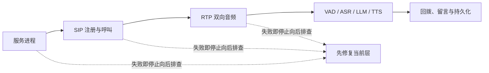

# 🩺 故障排查与运维

本文按“服务进程 → SIP 注册/呼叫 → RTP 音频 → AI 流水线 → 回拨与持久化”的顺序排查。先确定故障属于哪一层，再缩小范围；不要仅因电话能拨通就假定模型、RTP 或持久化正常。

相关前置配置见 [00-快速开始与部署](00-快速开始与部署.md)、[01-HT701网关配置与兼容性](01-HT701网关配置与兼容性.md) 和 [02-配置文件参考](02-配置文件参考.md)。



*图：按依赖顺序排查；前一层未验证通过时，后续现象通常没有诊断价值。*

## 🧭 1. 先收集最小事实

每次排障先记录以下信息，并对电话身份、正文和密钥脱敏：

|项目|要确认的事实|
|---|---|
|时间|故障开始和结束时间（含时区）。|
|版本|提交版本、运行的配置副本、是否存在未提交改动。|
|角色|拨打的 Assistant 号码、是否经过前台切换。|
|电话状态|HT701 是否已注册；是未接通、接通无声、单向音频还是播放中断。|
|日志|`LogSetting.LogFilePath` 当天滚动文件中相同时间窗口的 `Warning`/`Error` 及必要上下文。|
|依赖|FFmpeg 是否可执行；本地模型文件、网络出口、LLM/TTS 凭据是否有效。|
|数据|是否触发挂断、回拨、未读留言或 DTMF，数据库是否可读写。|

示例配置默认把日志写到 `./logs/log.txt` 并按天滚动，保留数由 `RetainedFileCountLimit` 控制。生产环境不要长期使用 `DEBUG`：仅在复现窗口提高日志级别，完成后恢复到较低级别，并按 [08-安全、隐私与生产运行边界](08-安全、隐私与生产运行边界.md) 的规则保存和访问日志。

## 🩹 2. 分层排查路径

```text
进程与本机依赖
  └─ SIP UDP 监听与 HT701 注册
       └─ INVITE / 号码 / SDP 协商
            └─ 双向 RTP 与编解码
                 └─ VAD → ASR → LLM → TTS
                      └─ 回拨、离线留言、DTMF、数据库
```

从上到下检查。上层未通时，不要把精力放在下层模型参数；下层出错时，也不要反复修改网关账号。

### 2.1 服务未启动或启动后立即失败

**检查项：**

- 运行目录是否包含实际使用的 `configs/config.json`，相对路径是否以该进程工作目录解析。
- `SIPConfig.IP` 是否是可绑定的本机地址；示例值 `0.0.0.0` 表示监听所有本机 IPv4 地址，不是网关应填写的服务器地址。
- `SIPConfig.Port` 是否被其他进程占用；当前服务创建的是 UDP SIP 通道。
- `SIPConfig.FFmpegPath` 指向的 FFmpeg 是否存在且进程有执行权限。嵌入提示音缓存和外部音频解码都依赖 FFmpeg。
- 日志中的“已启动 SIP 服务，监听地址”是否与预期 IP、端口一致。

**常见现象与处置：**

|现象|优先检查|处置方向|
|---|---|---|
|启动报绑定失败|IP/端口、已有服务、防火墙策略|释放冲突端口或改为可绑定的地址/端口；同步修改网关 SIP Server。|
|启动时提示音缓存失败|FFmpeg 路径、资源解码错误|先修复 FFmpeg，再检查资源包和进程权限；提示音缓存无法加载会影响启动可用性。|
|启动成功但没有日志文件|工作目录、`LogFilePath` 的父目录权限、磁盘空间|使用可写路径并保留控制台日志；不要通过关闭日志掩盖问题。|
|服务频繁停止|异常前的首个 Error、宿主退出信号、磁盘/内存|优先保留原始异常和堆栈，避免只根据最后一条“服务停止”判断原因。|

### 2.2 HT701 无法注册或显示离线

**检查顺序：**

1. 网关与服务端是否可达：IP、子网、网关、VLAN 与防火墙路径正确。
2. HT701 的 SIP Server/Outbound Proxy（若使用）是否指向服务端可达地址和 `SIPConfig.Port`。
3. 注册账号、认证账号、认证密码和拨号计划是否与部署约定一致。
4. 查看服务日志中是否收到 `REGISTER`；未启用 `AuthEnabled` 时服务接受注册，启用后必须存在并正确注册 `IBasicVerify` 实现。
5. 确认注册没有马上以 `Expires: 0` 注销；重启后，持久化注册记录会尝试恢复，恢复失败的记录会被移除。

系统只会接受已注册设备的正常呼入。启用认证但没有可用验证器、验证失败、请求格式错误，都会导致 SIP 拒绝。排查时记录状态码及请求方法，不要把账号密码原样复制到工单或聊天记录。

### 2.3 可以注册但拨号失败

|现象|可能层级|确认方式|处理方向|
|---|---|---|---|
|未注册设备拨号被拒绝|注册/认证|检查 REGISTER 是否成功、设备是否仍在有效期内|先恢复注册；不要绕过设备身份校验。|
|未知号码|号码路由|核对 INVITE 被叫号码与 `AssistantConfigs.DialingNumber`|增加/修正 Assistant 配置并重启加载配置的宿主。|
|协商失败或 488|SDP/codec|抓取 SIP/SDP，比较网关提供的音频 codec 与项目支持的 codec|调整 HT701 的优先编解码或使用项目支持的格式；不要只修改 RTP 端口。|
|听到振铃后被拒绝|Agent 初始化|查看“Agent 初始化超过…秒”、Provider/工具构建错误|检查模型、外部服务凭据、Function Tool 注册和 `AgentInitializationTimeoutSeconds`。|
|设备正处于回拨时再呼入|设备状态|日志及设备 `CallbackDialing` 状态|等待回拨结束；当前设计避免回拨与新呼入争用同一设备。|

首个 Provider、工具或 Handler 构建失败比后续 SIP 状态更有诊断价值。初始化超时会以暂时不可用拒绝挂起的呼入，默认由 `AgentInitializationTimeoutSeconds` 控制（代码将最小等待值限制为 10 秒）。

### 2.4 接通无声、仅一方有声音或提示音中断

按两个方向分别验证：

```text
电话 → HT701 → RTP 到服务 → 解码 / VAD / ASR
服务 → TTS / 提示音 → 编码 RTP → HT701 → 电话
```

**双方都无声：** 先确认 INVITE/200 OK/ACK 完整，随后检查 RTP 是否双向到达。当前媒体会话按协商的音频格式和 `ptime` 发送；网关、防火墙或 NAT 阻断动态 RTP 会造成 SIP 接通但没有音频。不要在文档外假设固定 RTP 端口范围，应按实际部署、协商和网络策略放行。

**上行无声（用户说话没有回复）：** 检查电话线、HT701 FXS 端口、网关 codec、RTP 入站方向和 VAD。若 RTP 已抵达，检查 ASR 缓存/日志是否出现分段、VAD 是否持续判定静音，以及是否因长时间无语音触发连接关闭。调低 VAD 阈值前，先保留一段可复现的非敏感测试语音并比较结果。

**下行无声（能看到模型回复但电话听不到）：** 检查 TTS Provider 的首个错误、WebSocket/HTTP 外网连通性、FFmpeg、音频编码和 RTP 出站。启动时预缓存的提示音也无声时，优先定位 RTP/codec 或网关 FXS；提示音正常而 TTS 无声时，优先定位 TTS Provider 或其凭据。

**回铃或不可用提示重复/不停止：** 检查角色切换是否结束、`180.mp3` 播放任务是否收到取消、通话是否已挂断。切换路径会在成功、失败和异常分支停止回铃；若重现问题，应保留切换开始、Pipeline 构建、停止回铃和挂断的同一时间窗口日志。

### 2.5 VAD、ASR、LLM 或 TTS 异常

|层级|典型症状|优先检查|
|---|---|---|
|VAD|用户说话始终不触发识别，或环境音不断打断回复|模型文件、采样格式、阈值、静音/最大语音时长。|
|ASR|触发后无文字、文字为空或明显乱码|模型及 tokens 文件、语言/归一化设置、输入采样率、ASR 批处理参数。|
|LLM / Intent|ASR 正常但无回答、工具不调用或意图判错|`BaseUrl`、`ApiKey`、`ModelName`、网络出口、Prompt、`Intent` 模式与 `AllowedTools`。|
|TTS|LLM 有文本但无语音或断流|TTS 凭据、Speaker/ResourceId、WebSocket/HTTP 状态、缓存路径及 RTP 编码。|

请区分“模型不可用”和“角色未被授权”。例如，工具已在宿主注册但未列入该 Assistant 的 `AllowedTools`，该角色不会得到该工具；需要 DTMF 工具交互的角色则应采用 `FunctionCall` 意图模式。角色切换会重新构建 Function Tool → Provider → Handler，某个目标角色缺少依赖时会播放不可用提示并结束本通电话。

### 2.6 回拨、离线留言或按键失效

|现象|检查要点|
|---|---|
|用户挂机后未回拨|确认回复是否已完成；确认设备仍有未过期注册 Contact，且未被其他呼入/回拨占用；检查 `CallbackTimeoutSeconds`、网络和电话是否接听。|
|回拨未接后留言消失|核对助手消息是否以 `Unread` 保存、`UserAor + AssistantNumber` 是否一致、清理任务是否过早删除。|
|再次呼入没有留言菜单|确认同一用户拨到了同一个 Assistant 号码；检查 `GetUnreadAssistantMessagesAsync` 的数据与 DTMF Provider 是否已构建。|
|按 `1`/`2` 没反应|检查 HT701 DTMF 传输方式、RTP 事件是否抵达、当前是否确实处于按键窗口；同一时刻只能有一个窗口。|
|按键超时后动作仍执行|这是逻辑错误；应检查调用方是否正确处理 `TimedOut`、`Cancelled`、`CallEnded` 或 `Unavailable`。|
|`10088` 无法启动或任务失败|检查服务账户的 Codex 登录、`CODEX_CLI_PATH`/`PATH`、工作目录是否为 Git 仓库；不要向电话或日志输出 CLI 认证材料。|

## 🛠️ 3. 运行维护

### 3.1 变更前后检查

|时机|必要动作|
|---|---|
|修改配置前|备份配置及数据库；确认不含真实密钥的版本可进入源代码管理。|
|修改模型/提示词/工具后|重启后检查角色初始化日志，再用测试号码完成一轮呼入、回答和挂断。|
|修改网关或网络后|依次验证注册、入呼、双向音频、DTMF；若启用回拨，再验证回拨。|
|升级依赖后|运行相关自动化测试，并在隔离网络验证 SIP/音频协商。|
|发生事故后|保全脱敏日志、配置版本、数据库备份和最小复现步骤，再做修改。|

### 3.2 建议监控的信号

项目当前没有内置指标导出，因此可先基于结构化日志和外部进程监控建立最小可观测性：

- 进程存活、重启次数、CPU、内存、磁盘空间与日志写入失败。
- 当前注册设备数、注册失败数、呼入数、接通数、SIP 拒绝状态分布。
- VAD/ASR/LLM/TTS 的失败次数和耗时；不要将完整音频或会话正文作为指标标签。
- Assistant 初始化超时、切换失败、回拨尝试/接通/失败、未读留言数量。
- DTMF 等待成功/超时/取消的计数，以及 SQLite 写入/清理失败。

日志中已有设备 ID、通话 ID、目标 Assistant 号码等占位符。采集系统应对它们按隐私数据处理，并避免扩展为记录完整 AOR、电话号码、转录内容、提示词或密钥。

## ♻️ 4. 升级与恢复原则

- 先在测试电话和隔离配置中验证新版本；生产升级前备份 `data/` 下的数据库和必要配置，而不是盲目复制临时音频缓存。
- 发生问题时优先回退应用与配置的已知可用组合；不要通过删除数据库或清空所有日志来“恢复”。
- 数据库恢复后应验证设备注册有效期和未读留言数量；过期注册不能被当作可回拨 Contact。
- 模型、FFmpeg 和提示音资源需与运行版本的目录约定一致。资源获取路径见 [09-项目目录、外部资源与内置提示音](09-项目目录、外部资源与内置提示音.md)。
