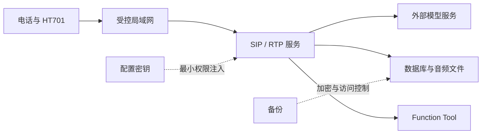

# 🛡️ 安全、隐私与生产运行边界

Agent.Telephone 同时处理 SIP 身份、语音、转录、模型密钥、聊天记录和可选的主机自动化能力。示例配置适用于开发演示，不应直接暴露到公网或直接作为生产配置。本章给出当前实现可支持的安全边界，以及部署者必须补齐的控制措施。

*图：网络、密钥、通话数据和工具权限是四条独立防线，任一条都不应只依赖“在内网”。*

## 🎯 1. 资产与风险边界

|资产|来源或位置|主要风险|
|---|---|---|
|SIP 身份与 Contact|REGISTER、设备注册持久化|未经授权设备注册、伪造/过期 Contact、错误回拨。|
|电话号码 / AOR|SIP 请求、`DeviceRegistrationRecord`、会话日志|可识别个人或设备身份。|
|语音、ASR 文本、LLM 回复|音频缓存、`ConversationMessage`、`MessageSegment`、日志|泄露通话内容、敏感业务信息或个人数据。|
|模型与云服务凭据|`config.json` 的 LLM/TTS 配置|密钥提交、日志泄露、越权调用和费用风险。|
|SQLite 数据库与备份|示例默认 `./data/messages-db/messages.db`|未读留言、文本和注册信息外泄或损坏。|
|Codex 任务助理|本机 Codex CLI、受控工作目录、CLI 认证|电话用户诱导主机执行超出预期的读取、网络或外部工具操作。|

安全目标是让每种数据只被完成通话服务所需的主体访问，并在不再需要时按照留存策略安全删除。不要把“内网”当作足够的身份验证，也不要把外部模型服务的 HTTPS 当作本机数据保护的替代品。

## 🔐 2. 密钥和配置管理

示例 `config.json` 中的 `ApiKey`、`AccessToken`、`AppId` 等必须只保留占位值。真实配置与仓库分离，并按最小权限存放在受保护的部署系统、操作系统机密存储或受控环境变量/配置注入中；选择方式应符合宿主的运维方案。

必须做到：

- 不提交真实 API Key、Access Token、SIP 密码、电话号码、录音、转录、日志、数据库、模型缓存或 Codex 的本地认证数据。
- 为开发、测试、生产使用不同凭据和不同项目/账号；撤销测试密钥不应影响生产。
- 定期轮换凭据。怀疑泄露时先撤销或替换密钥，再清理历史副本、构建产物和日志。
- 用最小权限的文件系统账户运行服务，限制其对配置、数据目录、模型目录和日志目录的读写范围。
- 配置变更进入生产前进行双人复核，尤其是外部 `BaseUrl`、模型名称、文件保存路径和可用工具列表。

`TTSSettings` 会覆盖选定 TTS 配置中同键的值；审查角色配置时，既要检查全局 `ModelConfig`，也要检查每个 Assistant 的覆盖项，防止意外把测试凭据或不应使用的 Speaker/资源带进生产。

## 🌐 3. SIP、RTP 与网络隔离

当前服务在 `SIPConfig.IP:SIPConfig.Port` 上创建 UDP SIP 监听。示例值 `AuthEnabled: false` 表示不验证 SIP 设备身份，**只适合受控开发网络**。生产至少应采取以下措施：

1. 启用 `AuthEnabled`，并提供经过审查的 `IBasicVerify` 实现；缺失验证器时系统会拒绝请求，不应通过关闭认证规避该错误。
2. 将 HT701、服务端和管理终端放入受控网段/VLAN；只向明确的网关地址开放配置的 UDP SIP 端口和实际媒体所需的 RTP 网络路径。
3. 使用防火墙或 ACL 限制可向服务端发送 SIP/RTP 的源地址；不要把 SIP 监听和所有动态媒体路径无差别暴露给公网。
4. 不要把未加密 SIP/RTP 直接穿越不可信网络。若业务必须跨越该边界，应在网络层提供受控加密通道，并先验证网关和部署方案的兼容性。
5. 保持网关管理界面仅在管理网可访问，修改默认管理凭据，关闭不需要的远程管理服务，并及时更新厂商固件。

回拨依赖设备最近注册的 `Contact`。持久化层会恢复未过期注册，但注册有效期、设备身份和 Contact 都应视为安全输入：不要把数据库中的任意字符串直接当作可信外呼目标，也不要为“方便测试”绕过设备占用与有效期检查。

## 💾 4. 对话、音频、日志和数据库

### 4.1 数据最小化与留存

示例存储实现会保存用户和 Assistant 的完整文本、分段文本、可选音频路径、时间、投递状态，以及设备注册信息。助手回复在用户挂机后可能从 `Generating` 变为 `Unread`，因此这是实际的离线留言数据，不是无害的技术缓存。

生产策略应明确以下事项：

- 是否启用 ASR/TTS 文件保存。示例配置中的 `FileSavingOption.SaveFile` 为 `true` 时，缓存目录可能含有通话相关音频，应按录音数据同等保护。
- 对话、留言和音频的留存天数、最大会话消息数、清理频率和法定/业务例外。示例 SQLite 存储提供 `RetentionDays`、`MaxMessagesPerConversation` 和逻辑删除选择，部署者仍要定期核对清理是否成功。
- 谁可以播放未读留言、导出会话或查看数据库；应按 `UserAor + AssistantNumber` 隔离，不能仅按电话号码或设备 ID 查询。
- 用户告知和同意要求、数据主体请求以及跨境传输要求。这些取决于实际所在地区、客户合同和数据类型，应由组织的合规负责人确认。

### 4.2 日志规则

日志用于排障，不应用作会话存档。保留有助于关联问题的通话 ID、角色、状态和错误码即可；避免新增以下内容到 Info/Debug 日志：

- API Key、Access Token、Authorization 请求头、SIP 密码或完整配置文件。
- 完整 AOR、电话号码、SIP Contact、音频二进制数据、完整 ASR/LLM 文本。
- Codex 任务正文、CLI 认证材料、完整命令输出、文件内容或第三方应用返回的敏感字段。

日志目录应限制为服务账户和受审计的运维人员可读，按留存天数自动轮转并集中采集时开启传输保护。调试时若必须临时记录更多内容，应取得授权、限定窗口、使用脱敏副本并在问题解决后删除临时数据。

### 4.3 数据库、缓存与备份

- SQLite 数据库文件和其伴随文件要放在受限目录，禁止通过 Web 根目录、共享下载目录或普通用户可写目录暴露。
- 备份至少应加密、受访问控制并可恢复；定期在隔离环境演练恢复，确认未读留言、会话状态和注册记录没有损坏。
- 恢复时不要把失效的注册记录当作当前 Contact 使用；设备会在后续 REGISTER 时刷新注册。
- 音频缓存、日志和数据库须分别管理。清空 TTS/ASR 缓存不等同于删除会话数据库；删除数据库也不一定删除缓存中的音频文件。
- 升级或迁移存储实现时，先备份并验证 `ITelephoneStore` 的身份隔离、状态变迁和清理语义。详细存储契约见 [05-持久化、回拨与离线留言](05-持久化、回拨与离线留言.md)。

## 🧰 5. Function Tool 的授权边界

`AllowedTools` 是每个 Assistant 的允许列表。应遵循“默认不授权”的原则：

- 只把工具赋给确实需要它的号码。前台可切换角色不代表专业角色也能切换；普通问答不应继承主机控制能力。
- 工具参数必须在实现中做业务校验，不能把模型生成的文本视为已授权命令。
- 有副作用的操作必须设计明确的用户确认、超时、取消和审计路径。DTMF 未按、超时、挂断、回拨失败都不是确认。
- `FunctionTool`/`PrivateFunctionTool` 不应直接暴露 SDK 的 SIP/RTP 内部对象或任意文件系统/网络对象；通过窄接口（如 `IAssistantControl`）实现需要的能力。

角色切换工具只接收配置中已有的目标 Assistant 号码，并且保留原 SIP/RTP 会话。它不是任意 SIP 转接接口，也不应扩展为接受外部号码、URI 或用户提供的网络地址。

## 🧪 6. Codex 任务助理的额外控制

当前 Codex 示例会通过 App Server 创建并续接持久化 Thread，并明确使用只读沙箱和 `approvalPolicy: "never"`。本项目没有为电话用户实现审批、运行中追问或写入权限升级。因此部署时至少满足：

1. 仅在隔离、低权限的专用主机和显式批准的固定工作目录中运行；不得把工作目录改为用户目录、共享盘、源码仓库根目录或系统目录。
2. CLI 认证、插件和 MCP 连接由受控服务账户预先配置；电话服务不复制、打印或存储 CLI 的认证材料。
3. 只将 `RunCodexTaskAsync` 授权给 Codex，并限制可注册、可拨入该号码的设备；不能把“任何能注册的电话”视为可操作主机的身份。
4. 把 SQLite 中的 `UserAor`、Assistant 号码和 Thread ID，以及 `CODEX_HOME` 中的会话数据，一并纳入访问控制、备份和留存策略；二者都可能关联到具体用户和任务。
5. 如需审计，记录脱敏的任务开始、结束和退出码，但不要记录任务全文、完整输出、命令、文件内容或密钥。
6. 需要写文件、危险网络访问、外部 App 副作用或运行中用户问答时，不要通过修改提示词绕过限制；应改用有独立审批设计的集成。

## ✅ 7. 生产上线检查表

|类别|上线前必须确认|
|---|---|
|配置|所有密钥均来自受控配置；示例占位值、调试 URL 和开发功能未进入生产。|
|网络|SIP/RTP 仅对受控网段开放；认证已启用并实测拒绝未授权设备。|
|账号|服务账户最小权限；HT701 管理密码已更新；生产与开发凭据隔离。|
|数据|数据库、缓存、日志、备份均受 ACL/加密/留存策略保护；恢复演练完成。|
|角色与工具|逐个核对每个 Assistant 的 Prompt、`AllowedTools` 和副作用确认策略。|
|可观测性|异常、初始化超时、回拨失败、存储失败可被告警；告警内容经过脱敏。|
|应急|具备禁用外部模型密钥、下线单个 Assistant、停止服务和恢复数据库的书面步骤。|

安全配置不是一次性工作。新增模型服务、存储后端、网关型号、Function Tool 或外部集成时，都应重新做一次数据流、权限和网络暴露面审查。

上一篇：[07-故障排查与运维.md](07-故障排查与运维.md) 
下一篇：[09-项目目录、外部资源与内置提示音.md](09-项目目录、外部资源与内置提示音.md)
