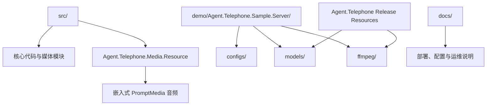

# 🗂️ 项目目录、外部资源与内置提示音

本章用于定位“应修改的源码”“应下载的运行资源”和“不能提交的本地产物”。资源文件、模型文件可从 [Agent.Telephone Release Resources](https://github.com/mm7h/Agent.Telephone/releases#release-resources) 下载：解压时应把 `ffmpeg/` 和 `models/` 保持在示例宿主的工作目录下，而不是多包一层目录。



*图：源码内置提示音随程序集发布；模型与 FFmpeg 是示例宿主运行期的外部资源。*

## 🧱 仓库目录

| 路径 | 作用与内容 |
| --- | --- |
| `src/Agent.Telephone.Abstractions/` | 公共配置模型、持久化模型和 `ITelephoneStore`、FunctionTool 公共能力接口。不能依赖核心实现或暴露 SIPSorcery 类型。 |
| `src/Agent.Telephone/` | SDK 核心实现。外部扩展应依赖公开接口，不应引用此项目中的内部类型。 |
| `src/media/Agent.Telephone.Media.Abstractions/` | 音频播放器、混音器、编辑器等媒体公共抽象。 |
| `src/media/Agent.Telephone.Media/` | SDK 媒体实现。对外可用能力以 `Agent.Telephone.Media.Abstractions` 中的公开接口为准。 |
| `src/media/Agent.Telephone.Media.Resource/` | `PromptMedia/` 下的内置提示音及其嵌入程序集配置。 |
| `demo/Agent.Telephone.Sample.Server/` | 可运行示例宿主：`Program.cs`、`configs/`、示例 FunctionTool、SQLite `MessageStore`，以及开发中的 Codex 集成样例。 |
| `tests/Agent.Telephone.Tests/` | xUnit 测试，覆盖 SIP 注册、通话生命周期、媒体、DTMF、角色切换、持久化和离线留言。 |
| `docs/` | 部署、配置、架构、扩展和运维文档；`HT701 Settings/` 是现有网关设置截图与说明。 |
| `Agent.Telephone.sln` | .NET 解决方案入口。 |
| `.editorconfig` / `.gitignore` | 格式和忽略规则；新增源码/文档应遵守。 |
| `.vs/`、`bin/`、`obj/`、`artifacts/` | IDE 或构建产物，不是源码；不要手工修改或提交。 |

## ▶️ 示例宿主的运行期目录

| 路径 | 来源与用途 |
| --- | --- |
| `configs/config.json` | 用户维护的 JSONC 配置。`configs/AssistantPrompts/*.md` 是角色系统提示词文件。 |
| `ffmpeg/` | 外部下载的 FFmpeg 根目录；由 `SIPConfig.FFmpegPath` 指向。 |
| `models/` | 外部下载的本地 ONNX/Sherpa 模型；代码按下节的固定规则查找。 |
| `logs/` | 运行日志，路径由 `LogSetting.LogFilePath` 控制。可能含电话身份或错误上下文。 |
| `data/asr-cache/`、`data/tts-cache/` | 仅在相应 `FileSavingOption.SaveFile` 为 `true` 时生成。包含用户语音或合成回复，应按隐私数据保护和清理。 |
| `data/messages-db/` | 示例 SQLite 留言/对话数据库默认位置。应纳入备份、权限与保留策略。 |

### 本地模型目录规则

本地模型的根目录遵循以下规则：

```text
models/{providerType}/{kebab-case-model-name}/
```

| 配置键 | 示例路径 | 必需文件 |
| --- | --- | --- |
| 原生 VAD `SileroNative` | `models/vad/silero-native/` | `model.onnx` |
| Sherpa VAD `Silero` | `models/vad/silero/` | `model.onnx` |
| ASR `SenseVoice` | `models/asr/sense-voice/` | `model.onnx`、`tokens.txt` |
| ASR `Paraformer` | `models/asr/paraformer/` | `model.onnx`、`tokens.txt` |
| TTS `Kokoro` | `models/tts/kokoro/` | `model.onnx`、`voices.bin`、`tokens.txt`、`espeak-ng-data/`、`dict/`，以及配置引用的词典。 |

模型是否需要取决于所选配置：使用云端 ASR/TTS 不代表所有本地模型都必需，但默认的 `SileroNative` 仍需要它的 ONNX 文件。下载后先检查路径，而不是只检查压缩包是否存在。

## 🎵 `Agent.Telephone.Media.Resource` 的工作方式

项目文件将 `PromptMedia\**\*` 声明为 `EmbeddedResource`，并将相对路径作为逻辑资源名。服务启动时会准备普通提示音，以及 `error_feedback/{100-699}.mp3` 形式的精确 SIP 状态码提示音；播放时再按当前通话协商的采样率处理。也就是说：

- `PromptMedia/` 是编译输入，不是需要额外复制到部署目录的运行时文件夹。
- 新增提示音必须放入该目录，重新编译，并在代码中使用其相对路径；SIP 错误提示音必须使用精确的三位状态码文件名，例如 `480.mp3`。
- 不能只替换一个同名 MP3 就假定电话可用；应验证缓存加载、混音、RTP codec 和 ptime。

## 🔊 内置提示音清单

### 数字与首呼提示

| 文件 | 当前调用场景 |
| --- | --- |
| `numbers/0.mp3` | Assistant 拨号号码中出现数字 `0` 时的固定播报。 |
| `numbers/1.mp3` | Assistant 拨号号码中出现数字 `1` 时的固定播报；也用于 1 条未读留言菜单。 |
| `numbers/2.mp3` | Assistant 拨号号码中出现数字 `2` 时的固定播报；也用于 2 条未读留言菜单。 |
| `numbers/3.mp3` | Assistant 拨号号码中出现数字 `3` 时的固定播报；也用于 3 条未读留言菜单。 |
| `numbers/4.mp3` | Assistant 拨号号码中出现数字 `4` 时的固定播报；也用于 4 条未读留言菜单。 |
| `numbers/5.mp3` | Assistant 拨号号码中出现数字 `5` 时的固定播报；也用于 5 条未读留言菜单。 |
| `numbers/6.mp3` | Assistant 拨号号码中出现数字 `6` 时的固定播报；也用于 6 条未读留言菜单。 |
| `numbers/7.mp3` | Assistant 拨号号码中出现数字 `7` 时的固定播报；也用于 7 条未读留言菜单。 |
| `numbers/8.mp3` | Assistant 拨号号码中出现数字 `8` 时的固定播报；也用于 8 条未读留言菜单。 |
| `numbers/9.mp3` | Assistant 拨号号码中出现数字 `9` 时的固定播报；也用于 9 条未读留言菜单。 |
| `prompt/service_agent.mp3` | 首呼时，在逐位播报纯数字 `DialingNumber` 后播放；随后才播放随机 `HelloMessageTempletes` 的 TTS。 |

### 离线留言菜单

| 文件 | 当前调用场景 |
| --- | --- |
| `prompt/offline_message_less_part_1.mp3` | 有 1～9 条未读 Assistant 留言时，作为菜单前半段。 |
| `prompt/offline_message_less_part_2.mp3` | 有 1～9 条未读 Assistant 留言时，在对应 `numbers/{count}.mp3` 后作为菜单后半段。 |
| `prompt/offline_message_many.mp3` | 未读留言数为 10 条或以上时，替代带数字的菜单提示。 |

服务会根据未读数量组合这些音频。用户可按 `1` 播放留言或按 `2` 将当前未读快照标记为已读；菜单结束后恢复正常 Assistant 输入。

### SIP 状态与等待提示

| 文件 | 状态 | 当前代码中的实际状态 |
| --- | --- | --- |
| `error_feedback/180.mp3` | SIP `180 Ringing` | 已使用：切换 Assistant 时的循环背景音乐或者提示音。 |
| `error_feedback/480.mp3` | SIP `480 Temporarily Unavailable` | 已使用：目标角色初始化失败且无法恢复原角色时，播放后安全结束通话；Assistant 初始化失败时也会在接听后播放两遍并挂断。 |
| `error_feedback/400.mp3` | SIP `400 Bad Request` | 已嵌入并缓存；无效或缺失 SDP 无法建立 RTP，当前仍直接返回 SIP `400`。 |
| `error_feedback/402.mp3` | SIP `402 Payment Required` | 已嵌入并缓存/映射；当前没有业务播放调用点。 |
| `error_feedback/403.mp3` | SIP `403 Forbidden` | 已使用：认证失败、认证服务不可用或设备未注册且可协商媒体时，接听后播放两遍并挂断。 |
| `error_feedback/404.mp3` | SIP `404 Not Found` | 已使用：目标 Assistant 不存在且可协商媒体时，接听后播放两遍并挂断。 |
| `error_feedback/486.mp3` | SIP `486 Busy Here` | 已嵌入并缓存/映射；当前没有业务播放调用点。 |
| `error_feedback/488.mp3` | SIP `488 Not Acceptable Here` | 已嵌入并缓存/映射；没有共同 Codec 时无法发送 RTP，当前仍直接返回 SIP `488`。 |
| `error_feedback/503.mp3` | SIP `503 Service Unavailable` | 已使用：可协商媒体的未分类 INVITE 服务端异常时，接听后播放两遍并挂断。 |

这两个“未映射变体”不应在产品说明中描述为已生效功能。若要接入，先确定业务语义，并将文件改为精确状态码名称或建立新的非 SIP 提示音调用路径，再为取消、RTP 输出和错误路径补测试。

上一篇：[08-安全、隐私与生产运行边界.md](08-安全、隐私与生产运行边界.md)<br />
